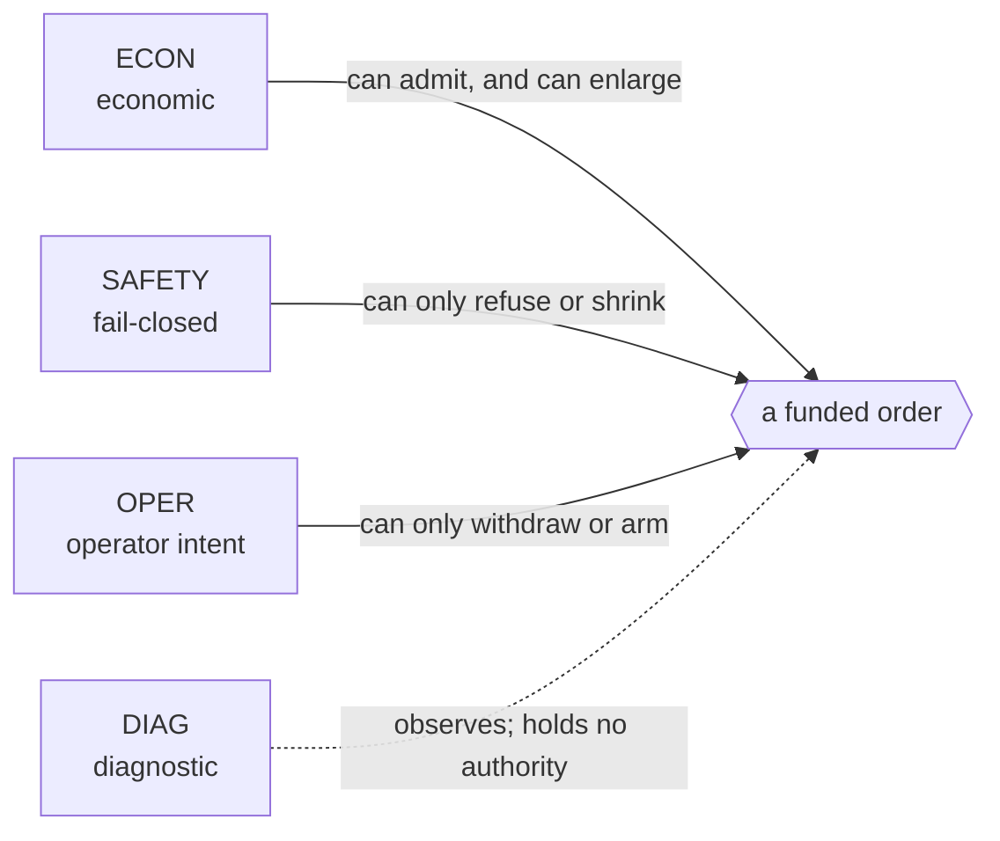
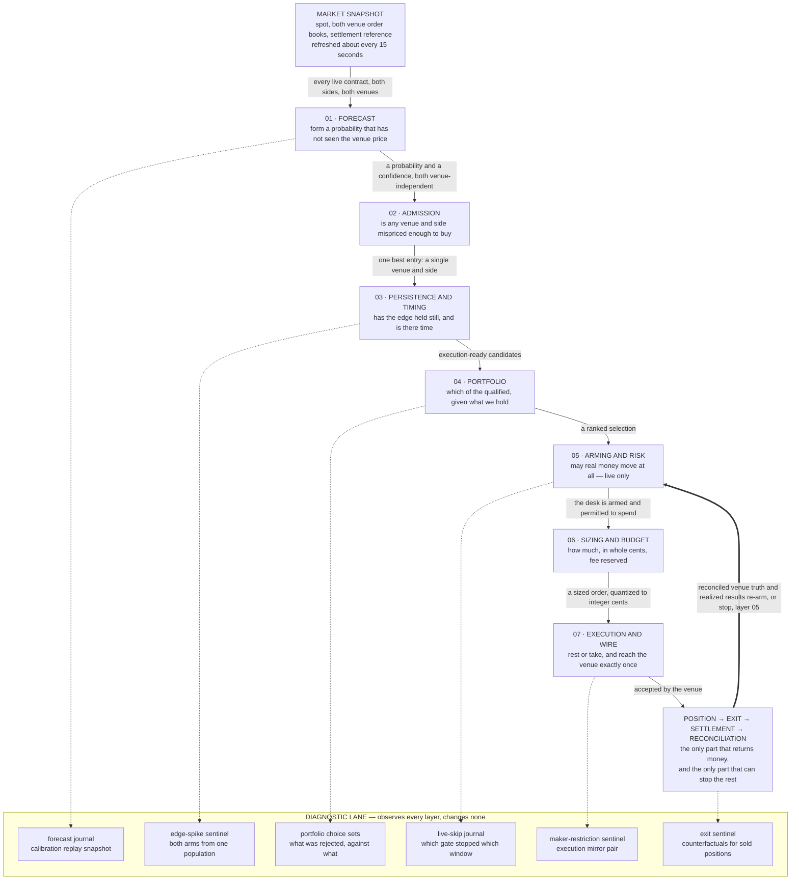
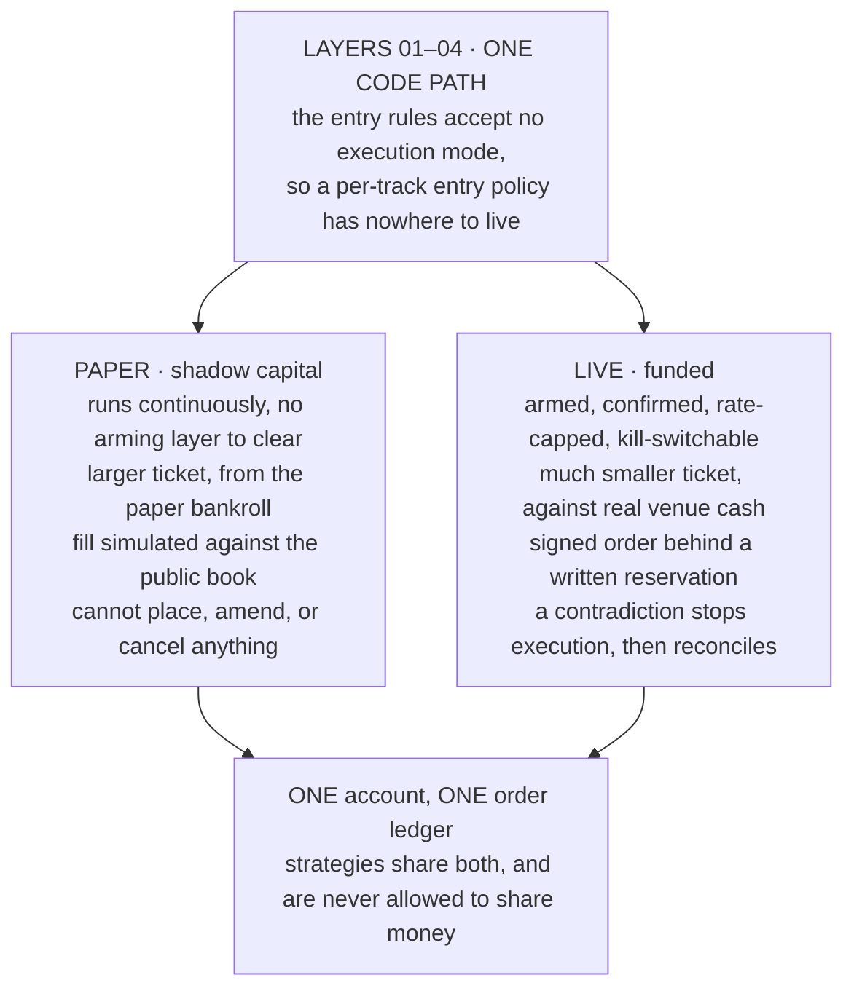

# Money Noodle decision stack

Seven layers stand between a price move and a filled order. Each layer can only *remove* candidates — never
add them. A candidate is one contract, one side, one venue; it enters at the top and either falls out at a
gate or reaches the wire.

What separates the layers is not where they sit in the file tree but **what kind of authority they hold**.
Sorting the gates that way answers the question that matters when something changes: could this edit have
made the desk trade *more*?

> Orientation only. This is not requirement, implementation, or operational authority — read `SPEC.md`, the
> canonical `spec/*.md` module, and the symbol itself. Thresholds move with policy versions; treat the
> numbers here as illustrative of the shape and read the symbol for the current value.
> Rendered version: [`decision-stack.html`](decision-stack.html)

---

## Four kinds of decision

| Tag | Category | What it may do |
| --- | --- | --- |
| `ECON` | Economic | Judges whether money is expected to be made. **The only category that can authorize a trade or enlarge one.** |
| `SAFETY` | Safety | Fail-closed. Can refuse a candidate or shrink a ticket; can never admit one. Ambiguity resolves to "no". |
| `OPER` | Operator | Human intent — arming, pausing, the kill switch, side and asset switches. Never resumes on its own. |
| `DIAG` | Diagnostic | Measures and records at decision time. Structurally unable to admit or refuse anything. |

The asymmetry is the point. Nothing tagged `SAFETY` can *cause* a trade — widen a price band or lift a cap
and the worst case is more volume through gates that already passed it, because an `ECON` layer still had to
say yes first. And `DIAG` gates compute a verdict, stamp it on the decision, then decline to act on it: that
is what lets a rule the desk has switched off keep accumulating the evidence that would justify switching it
back on.

---

## The stack

Every arrow into the diagnostic lane is one-way. The bold return edge is the only edge in the whole stack
that runs upward.

---

## Layer by layer

### 01 · Forecast

*Form a probability that has not been shown the venue price.*
`src/lib/dashboard.ts` → `src/lib/forecast-model.ts`

| | Gate |
| --- | --- |
| `ECON` | Contract basis: distance from the settlement reference over realized volatility |
| `ECON` | Slow tilts — momentum, seasonality, news — capped together at ±0.4 log-odds |
| `SAFETY` | Probability clamped to 3–97%; the venue term is excluded from the tradeable estimate |
| `ECON` | Confidence scored on data quality alone, never on agreeing with the market |

The venue price is deliberately kept out of the estimate. Blending it in and then subtracting it would shrink
the disagreement the desk exists to trade. Confidence works the same way: penalising disagreement with the
market would block precisely the mispricings being targeted.

### 02 · Admission

*Is any venue and side mispriced enough to buy? Takes no execution mode at all.*
`src/lib/prediction-policy.ts` — `qualifiesAsBuyEdge`, `hasTradableEdge`, `bestEntry`

| | Gate |
| --- | --- |
| `ECON` | `net edge = P(side) − ask − taker fee`, and it must clear the minimum net edge floor |
| `ECON` | The chosen side must be independently more likely than not; confidence above its floor |
| `SAFETY` | Entry price inside a bounded band — both ends bind, neither is a backstop |
| `OPER` | The DOWN/NO side is one switch, and it moves both tracks together |
| `DIAG` | A maximum-edge ceiling is still computed and stamped; it is currently disarmed |

This is the layer the mirror invariant protects. It takes no execution mode, so a paper-only or live-only
entry rule cannot be expressed here — `src/lib/mirror-invariant.test.ts` asserts the arity.

### 03 · Persistence and timing

*Has the edge held still, and is there still time to act on it?*
`src/lib/signal-persistence.ts`

| | Gate |
| --- | --- |
| `ECON` | A required run of qualifying snapshots spanning a minimum window — one miss resets the streak to zero |
| `ECON` | Median edge across the streak above its floor; current estimate quality above its floor |
| `SAFETY` | Cycle warm-up, and no new entry inside the late cutoff before close |
| `SAFETY` | Newest snapshot within its maximum age — a stale quote fails the decision, never warns |
| `DIAG` | Edge spike above its own median measured on every decision; the gate is disarmed |

The spike check runs last on purpose, so every cheaper refusal reports its own reason first and the sentinel's
declined arm is not polluted by decisions that would have been refused anyway.

### 04 · Portfolio

*Of everything that qualifies, which do we want given what we already hold?*
`src/lib/portfolio-policy.ts`, `updatePortfolioDecisions`

| | Gate |
| --- | --- |
| `ECON` | Ranked by expected profit in cents, less a penalty for each correlated position held |
| `SAFETY` | Caps on total open positions, positions per settlement window, and positions per correlation group |
| `SAFETY` | Excluded assets withheld from both tracks on their own measured evidence |
| `SAFETY` | The window's 15-second path must be characterised, or the candidate steps aside |

Caps are global, counted across the whole account. The regime filter applies to the candidate list rather than
the chosen order, so an unclassified top candidate steps aside for the next one instead of skipping the cycle.

### 05 · Arming and risk

*May real money move at all? Live only — every check here can refuse, none can admit.*
`src/lib/paper-execution.ts` → `runLive`, `src/lib/live-orders.ts`, `src/lib/live-risk-policy.ts`

| | Gate |
| --- | --- |
| `OPER` | Environment flag, kill switch, automation state — a manual pause never self-resumes |
| `SAFETY` | Reconciliation must read `ready`: cash, positions, orders, fills, resting orders |
| `SAFETY` | Risk stop on epoch drawdown or lifetime loss suspends the desk outright |
| `SAFETY` | Snapshot freshness, and a ceiling on filled live orders per hour |
| `DIAG` | Every refusal journaled under its own named class, never parsed back out of prose |

Operator intent is separate from operational state: a risk stop leaves intent active while the state is
paused, which is the difference between "the desk chose not to trade" and "the desk was stopped out". Only a
*system* suspension may auto-resume, and only after full reconciliation.

### 06 · Sizing and budget

*How much, in whole cents, with the fee already reserved.*
`src/lib/entry-sizing-policy.ts`, `buildOrder`

| | Gate |
| --- | --- |
| `SAFETY` | Ceiling is the minimum of the operator's proposed stake, the live cap, and spendable funds |
| `ECON` | Net edge below the full-size threshold takes a reduced ticket |
| `SAFETY` | The cap is all-in: fees reserved, quantity rounds down, cost rounds up, quantized once |
| `SAFETY` | Spread, maximum fillable ask, time to close, and venue cash all re-checked here |

Every ceiling is re-read *per placement*, not once per cycle — one cycle can commit real money several times,
so the hourly limit, funding headroom, and the exposure earlier placements just created are all recomputed
before the next order is built.

### 07 · Execution and wire

*Rest or take — and reach the venue exactly once.*
`src/lib/entry-execution-policy.ts`, `src/lib/managed-maker.ts`, `src/lib/live-orders.ts`

| | Gate |
| --- | --- |
| `ECON` | Rests as maker by default, repricing along the tick ladder over a short horizon |
| `ECON` | Pays the spread only when fresh edge, median edge, quality, and spread all clear together |
| `SAFETY` | That taker route is re-tested against a refreshed quote at submission time |
| `SAFETY` | Reservation written first; a duplicate client order id suspends the desk |
| `OPER` | A bounded number of entry episodes per window, each re-earning persistence |

### ↺ Position, exit, settlement, reconciliation

*The only part of the stack that returns money, and the only part that can stop the rest.*
`src/lib/exit-policy.ts`, `src/lib/execution-reconciliation.ts`

| | Gate |
| --- | --- |
| `ECON` | Strict value sells when executable cash beats the optimistic hold value by the minimum gain |
| `SAFETY` | Sells are reduce-only and side-aware; the side cools down before it may re-enter |
| `DIAG` | The withheld profit-reversal rule still arms and records what it would have sold |
| `SAFETY` | Reconciled on the configured cadence; a ledger-versus-venue contradiction stops execution |

---

## Where the two tracks part

The tracks differ in capital and plumbing, never in judgment. Paper exists to be a faithful shadow, so any
difference in *what* to buy would make it useless as a comparison. The only differences permitted are fills,
budget and sizing, rate limits, risk stops, and reconciliation.

---

## What this leaves out

Simplified deliberately, in favour of following the shape:

- **The switch and reversal path.** When the portfolio is full, layer 05 evaluates selling an incumbent to
  fund a strictly better candidate, which consumes two order slots rather than one.
- **The drain loop.** Layers 06 and 07 can run several times in one cycle.
- **Bounded experiments** riding alongside the production route with their own capped authorization, and the
  candidate evaluation lane, which never touches production.
- **Collection, storage, and compaction** beneath all of it, plus the stateless hosted read path, which has no
  write authority at all.
- **Exact thresholds.** Read them from the symbol, not from here.

Layer names are this document's, not the codebase's; the module named under each layer is the real entry
point. Nothing here is financial advice.
