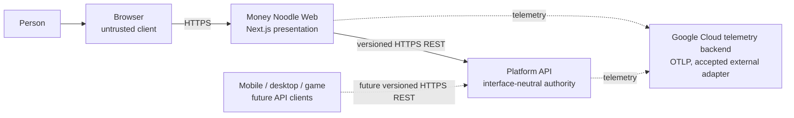
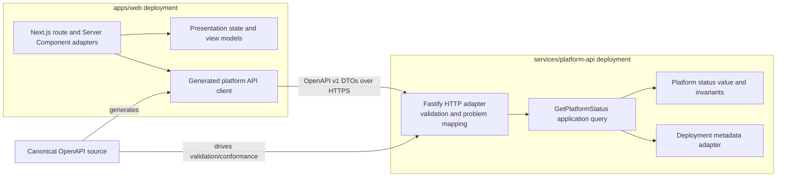
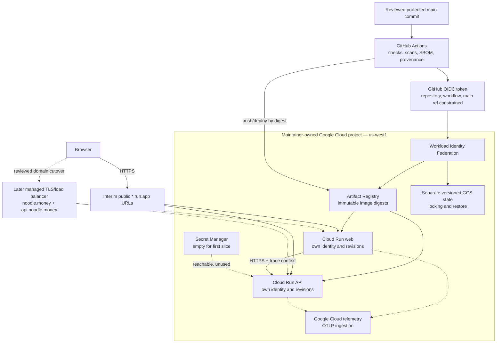
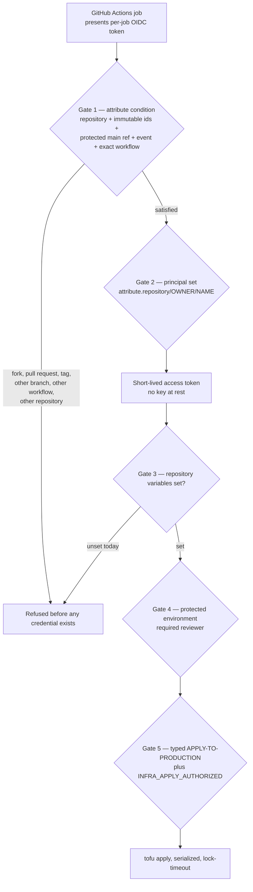
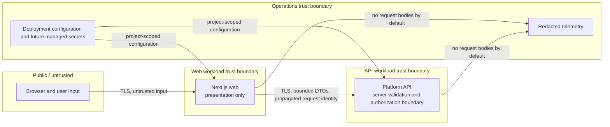
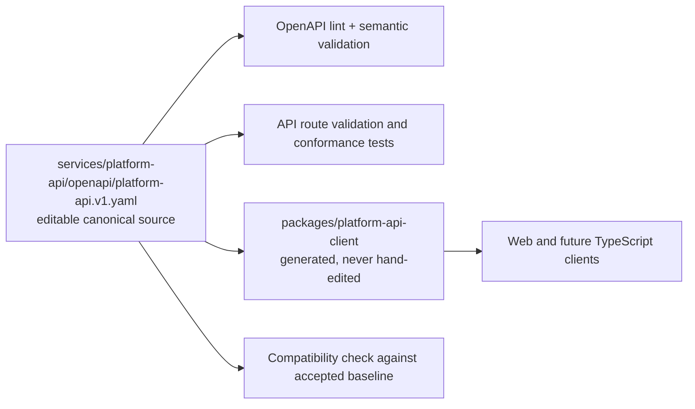
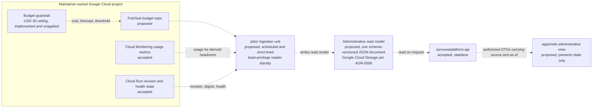

# First web/API architecture

> **Status:** Accepted
> **Accepted:** 2026-08-29 by the maintainer
> **Repository controls revised:** 2026-08-30 by the maintainer
> **Scope:** First independently deployable Next.js web and interface-neutral API slice
> **Related plan:** GitHub issue #2, child work item #4
> **Reference evidence:** [`reference-assessment.md`](reference-assessment.md)
> **Decisions:** [`decisions/README.md`](decisions/README.md)

## Purpose

This architecture establishes the smallest current boundary that can prove Money Noodle's web/API, contract, trust, deployment, and observability requirements without introducing identity, tenant data, a database, provider credentials, background work, simulation, or funded authority.

It is intentionally not a complete platform decomposition. New domains, stores, jobs, and providers require their own accepted boundaries and diagrams before implementation.

## Facts, assumptions, and unknowns

### Current facts

- The repository implements pnpm workspaces and Nx projects for the Next.js web, Fastify API, and generated OpenAPI client, with exact runtime/tool versions and a frozen lockfile.
- The public-source snapshot is staged on sole integration branch `main` as one root commit; a separate private archive preserves development history.
- CI is configured to validate formatting, lint, types, tests/coverage, contracts, builds, dependencies, secrets, attested OCI images, SBOMs, and HIGH/CRITICAL image vulnerabilities. GitHub Actions are currently disabled, so the squashed snapshot has no observed hosted-CI result yet.
- TypeScript is the default, REST/OpenAPI is required, the API must remain interface-neutral, and deployable projects must build and deploy independently.
- The web is a presentation client. It cannot become a worker, provider adapter, scheduler, data authority, or direct database client.
- Production has no real-money authority. Simulation and funded concepts remain structurally separate when they are introduced.
- The first standing remote environment is production; CI may create ephemeral resources, and there is no required persistent staging environment.
- The implemented foundation pins Node.js 22.22.0, pnpm 11.24.0, Nx 23.1.2, TypeScript 6.0.3, Next.js 16.3.3, React 19.2.8, and Fastify 5.12.1.

### Accepted direction

- Node.js 22.22.0 is the first web/API runtime across local checks, CI, and the digest-pinned production base image.
- Next.js 16 App Router is the web framework line; React Server Components are an adapter/presentation mechanism, not a service boundary.
- A Node.js TypeScript HTTP service using Fastify 5 is the separately deployable API adapter. Domain and application code do not depend on Fastify.
- Both request-serving projects are packaged as provider-portable OCI images. A provider may run an image as a container or compatible serverless container without changing application boundaries.

### Selected deployment composition and remaining open decisions

The accepted first composition is Cloud Run and Artifact Registry in `us-west1`, GitHub OIDC workload-identity federation, OpenTofu with separate lock-protected GCS state, Secret Manager, and Google Cloud OpenTelemetry ingestion. First remote validation uses public `*.run.app` URLs; the target domain cutover is `noodle.money` plus public `api.noodle.money` through a managed load balancer. Existing Vercel DNS remains untouched until that separately reviewed cutover. See [`../operations/deployment-composition.md`](../operations/deployment-composition.md) and accepted [`ADR-0004`](decisions/ADR-0004-first-remote-hosting-composition.md) through [`ADR-0007`](decisions/ADR-0007-first-telemetry-backend.md).

Quantitative service objectives remain open until dated remote evidence exists. Exact provider project, billing, and federation identifiers are bootstrap inputs, not architecture choices. Identity, PostgreSQL provider, tenant schema ownership, and provider integrations are deliberately deferred because the first slice does not need them.

## Accepted boundary

Create two deployable projects and one generated client package:

| Project | Path | Owns | Must not own |
| --- | --- | --- | --- |
| Web | `apps/web` | Next.js routes, rendering, accessibility, browser state, presentation mapping, web telemetry, server-only API-client composition | Canonical API behavior, database access, platform jobs, provider SDKs/secrets, funded or simulation authority |
| Platform API | `services/platform-api` | HTTP authentication/authorization adapters when introduced, runtime validation, application use-case composition, public/private DTOs, API telemetry, its future explicitly owned schema | UI rendering, long-running work, provider automation, another service's tables, frontend-specific workflow state |
| Generated TypeScript client | `packages/platform-api-client` | Generated transport models and request functions for TypeScript clients | Domain models, hand-maintained request code, business rules, secrets |

The API begins as one lightweight modular deployment rather than premature domain services. A module may move to its own service only after data ownership, scaling, failure isolation, or authority provides a material reason. The API must never become a resident multipurpose worker: commands that need external effects will persist intent and enqueue an isolated job or service in a later accepted slice.

Next.js Route Handlers may support web-only session callbacks or a narrow same-origin browser adapter when identity requires one. They are not the canonical platform API and cannot import platform repositories or execution code. The first slice needs no Route Handler: a Server Component calls the generated API client server-side.

## First vertical slice

The accepted first user-visible capability is a public **platform availability card**:

1. `services/platform-api` serves `GET /v1/platform/status` from a bounded application query.
2. The canonical OpenAPI document defines the response and standard error envelope.
3. `packages/platform-api-client` is generated from that document.
4. `apps/web` uses the generated client in a Server Component and renders state plus the API-provided `asOf` time.
5. API timeout, transport failure, incompatible schema, or invalid response renders **status unknown**. The web never invents an available state or silently serves stale status.

The endpoint is intentionally read-only, identity-free, tenant-free, database-free, and financially inert. It proves the cross-deployment contract, generated-client ownership, runtime validation, safe failure presentation, traces, independent artifacts, and remote smoke path before riskier capabilities exist.

### Public contract boundary

The exact wire schema is finalized with the OpenAPI implementation, but its accepted semantic minimum is:

- `state`: `available`, `degraded`, or `maintenance`;
- `asOf`: UTC RFC 3339 source time;
- `service`: stable service name plus attributable source/artifact version;
- `schemaVersion`: response schema identity;
- `requestId`: bounded diagnostic correlation value.

The endpoint contains no tenant, customer, secret, environment topology, dependency address, commit history, or exploitable diagnostic detail. Transport failure is represented by the client as `unknown`; `unknown` is not fabricated as an API observation.

Operational probes are separate from the public contract:

- `/health/live` says only that the process can answer;
- `/health/ready` says the deployment is ready to serve its declared contract;
- `/v1/platform/status` is the safe user-facing platform observation.

## Quality attributes for this slice

| Attribute | Acceptance |
| --- | --- |
| Independent delivery | Web and API build into separate immutable artifacts and can deploy or roll back without rebuilding the other when the OpenAPI compatibility range is unchanged. |
| Contract compatibility | The API validates responses at runtime; generated output is reproducible; CI rejects ungenerated drift and incompatible changes to the accepted v1 contract. |
| Failure clarity | API failure, timeout, invalid response, and version incompatibility render `unknown`, never `available` or zero-like fallback data. |
| Security | The browser receives no deployment credential. The web has only the API origin and a least-privilege workload identity if later required. The first API route is public and returns allowlisted fields only. |
| Portability | Domain/application code imports no Next.js, Fastify, cloud, telemetry-backend, or provider SDK. Both deployments use standard Node.js runtimes and OCI artifacts. |
| Observability | W3C trace context and a generated request ID cross web to API. OpenTelemetry records bounded request, latency, outcome, artifact, and route metadata without bodies or personal data. |
| Performance | The web uses one bounded API request with a declared timeout and no retry fan-out. Quantitative latency/error budgets are fixed from remote baseline measurements before the slice is called production-validated. |
| Accessibility | Availability is expressed in text and source time, not color alone. Loading and unknown states do not imply health. |

## Visual architecture

All first-slice elements below are **accepted architecture** unless labeled external or future.

### System context



The person can later use several interfaces concurrently. None owns canonical platform state. The API contract, not the web framework, is the shared boundary.

### Containers and dependency direction



Dependencies point inward: adapters depend on application/domain contracts. The generated transport DTO stops at each adapter boundary and is mapped before domain use.

### Production deployment



The pipeline deploys only affected projects. A contract change deploys in compatibility order: backward-compatible API first, then web; removal occurs only after all consumers no longer require the old field or operation. Existing Vercel DNS is outside this first validation and is unchanged.

### Infrastructure stacks, state, and cross-stack contracts

Implemented in `infra/` and **not applied**. Each stack owns its own state, so
applying one cannot lock, mutate, or break another. Values cross a stack boundary
only by reading a `contract_`-prefixed published output; a guard in
`tools/infra-policy.test.mjs` fails the build if a stack reads anything else.

```mermaid
flowchart LR
    subgraph bootstrapStack["stacks/bootstrap — applied once, by hand"]
        deployer["Deployer service account"]
        wif["Workload identity pool<br/>and GitHub provider"]
        buckets["Four state buckets<br/>versioned, private"]
    end

    subgraph platformStack["stacks/platform"]
        registry["Artifact Registry"]
        budget["USD 30 budget<br/>50 / 80 / 100% alerts"]
        secrets["Secret Manager boundary<br/>declared, empty"]
        retention["Log retention"]
    end

    subgraph apiStack["stacks/api"]
        apiSvc["Cloud Run API<br/>own runtime identity"]
    end

    subgraph webStack["stacks/web"]
        webSvc["Cloud Run web<br/>own runtime identity"]
    end

    bootstrapStack -->|contract_project_id<br/>contract_region<br/>contract_deployer_*| platformStack
    platformStack -->|contract_registry_url<br/>contract_telemetry_endpoint| apiStack
    platformStack -->|contract_registry_url<br/>contract_telemetry_endpoint| webStack
    apiStack -->|contract_service_uri| webStack

    buckets -. "separate state per stack" .-> platformStack
    buckets -. .-> apiStack
    buckets -. .-> webStack
```

The web reads the API's origin, never the reverse. That one-directional
dependency is what lets the API be applied while the web is running.

### Delivery gates

Provider authority is reached through two independent gates, then three further
authorization gates before anything is applied.



As committed, gate 3 is unset, so no path reaches a provider at all. Drift
detection reads on a schedule and never corrects; destroy is available to no
workflow.

### Trust boundaries



The first route has no authentication or tenant scope because it returns only a safe public status. Future private routes add identity and default-deny tenant authorization at the API and repository boundaries; they do not grant the web direct data authority.

### Critical request sequence

```mermaid
sequenceDiagram
    actor Person
    participant Browser
    participant Web as Next.js web
    participant Client as Generated API client
    participant API as Platform API
    participant Query as Status application query

    Person->>Browser: Open platform page
    Browser->>Web: GET /
    Web->>Client: getPlatformStatus(timeout, trace context)
    Client->>API: GET /v1/platform/status
    API->>Query: Execute validated read
    Query-->>API: PlatformStatus + asOf
    API-->>Client: Validated v1 response + request ID
    Client-->>Web: Typed transport DTO
    Web-->>Browser: Accessible status and source time
    Browser-->>Person: Available / degraded / maintenance

    alt timeout, transport error, invalid schema, or incompatible version
        Client-->>Web: Bounded typed failure
        Web-->>Browser: Status unknown; no invented fallback
    end
```

### Contract ownership and release flow



### Proposed administrative observability

Every element below is **proposed**, not accepted architecture. It is drafted in [`ADR-0009`](decisions/ADR-0009-administrative-observability-surface.md), depends on [`ADR-0008`](decisions/ADR-0008-single-object-store.md), and nothing in it exists on disk or in the provider. Dotted edges mark that proposed status; the solid boundaries it attaches to are the accepted ones above.



The API reads the read model and never calls a provider billing, deployment, or infrastructure API on a request path. The ingestion identity is a fourth principal, distinct from the deployer and from each service runtime identity.

## Source and deployment map

The workspace, projects, status contract, generated client, web presentation/API adapter, API inner layers/HTTP/deployment adapters, health routes, and container definitions below exist. `infra/` now exists as reviewable, statically validated configuration; **no provider resource has been applied**, and the outstanding items before an apply can be trusted are listed in [`../../infra/README.md`](../../infra/README.md).

No row below is proposed. `jobs/` does not exist, and neither the administrative ingestion unit, its read model, nor its API operations are represented here, because [`ADR-0009`](decisions/ADR-0009-administrative-observability-surface.md) is proposed rather than accepted. Rows are added when the projects exist, not when they are decided. The source repository is still private with Actions disabled, and no Google Cloud resource or federation exists.

| Path | Project/deployment | Boundary and ownership |
| --- | --- | --- |
| `apps/web/` | `web` | Independently built Next.js application and web OCI image |
| `apps/web/src/app/` | `web` adapter | App Router routes, layouts, Server Components, error/loading UI |
| `apps/web/src/presentation/` | `web` inner layer | Pure presentation mapping over client DTOs; no Next server APIs or platform work |
| `apps/web/src/adapters/platform-api/` | `web` outbound adapter | Server-only wrapper around generated client, timeout/error mapping, trace propagation |
| `services/platform-api/` | `platform-api` | Independently built stateless API and API OCI image |
| `services/platform-api/openapi/platform-api.v1.yaml` | API-owned contract | Editable canonical REST contract and version policy |
| `services/platform-api/src/domain/` | API inner layer | Framework-free values/invariants owned by this service |
| `services/platform-api/src/application/` | API inner layer | Use cases and ports; no HTTP, storage, cloud, or UI imports |
| `services/platform-api/src/adapters/http/` | API inbound adapter | Fastify composition, runtime validation, RFC 9457 problem mapping |
| `services/platform-api/src/adapters/deployment/` | API outbound adapter | Safe attributable deployment metadata; no provider secrets |
| `packages/platform-api-client/` | shared generated package | Generated TypeScript transport client consumed by interfaces |
| `infra/` | Google Cloud/OpenTofu composition, implemented and unapplied | All provider coupling. See [`../../infra/README.md`](../../infra/README.md) |
| `infra/modules/` | provider-neutral building blocks | No environment values; `delivery-trust` is provider-free and tested offline |
| `infra/stacks/bootstrap/` | one-time bootstrap | State buckets, deployer principal, workload identity federation |
| `infra/stacks/platform/` | shared platform stack | Artifact Registry, budget, telemetry retention, secret boundary |
| `infra/stacks/api/`, `infra/stacks/web/` | per-service stacks | Own Cloud Run service, runtime identity, and separate state per ADR-0006 |
| `.github/workflows/delivery.yml` | delivery pipeline | Infrastructure checks, digest publication, gated apply, drift, rollback |
| `docs/architecture/` | governed documentation | Current diagrams, decision records, and source/deployment map |

Every created project receives a README declaring purpose, contracts, targets, dependencies, runtime, deployment unit, configuration, health checks, and owned data. Nx tags and lint rules enforce at least:

- `apps/web` cannot import API service source;
- the generated client cannot import web or API implementation;
- API domain/application layers cannot import Fastify, Next.js, cloud SDKs, or telemetry backends;
- no request-serving project imports a future job/provider adapter implementation;
- dependency cycles fail CI.

## API and generated-client policy

The detailed decision is in [`ADR-0002`](decisions/ADR-0002-openapi-and-generated-client.md). In summary:

- the API service owns one editable OpenAPI 3.1 document for v1;
- public operations use the `/v1` URI prefix;
- additive compatible changes remain in v1; breaking semantics require `/v2` and an explicit migration window;
- operations have stable `operationId` values used by generation;
- errors use RFC 9457 Problem Details plus a stable Money Noodle error code and safe request ID;
- request and response bodies are runtime-validated at the HTTP boundary;
- generated files are reproducible and never manually edited;
- CI compares the contract with the accepted baseline and rejects undocumented breaking changes;
- generated DTOs are transport types and are mapped before entering domain rules;
- commands later add principal/scope, client identity, correlation, expected version, and idempotency as required by their capability design.

## Runtime and deployment responsibilities

### Web deployment

- Render public and authenticated presentation when those contracts exist.
- Call only declared APIs through generated clients.
- Bound upstream timeouts and retries; do not fan out retries from components.
- Report API unavailable/incompatible states without direct database, filesystem, localhost, or engine fallback.
- Expose liveness/readiness and attributable artifact/config versions without secrets.
- Never start recurring work, migrations, provider calls, or funded/simulation execution.

### API deployment

- Authenticate and authorize every non-public request when identity is introduced.
- Validate wire input/output, map transport errors, execute bounded use cases, and enqueue external work rather than performing it in interactive request paths.
- Remain stateless between requests. Durable state and coordination use explicit repositories in later slices.
- Expose liveness/readiness plus safe public and scoped operational views.
- Own and migrate only its declared future schema through a single-owner deployment step.
- Never hold funded authority in the current phase.

### Pipeline

The foundation implements root and Nx targets for format checks, lint, type checks, tests/coverage, contracts, builds, and containers; [`../engineering/standards.md`](../engineering/standards.md) owns the exact command contract. CI runs affected targets plus repository documentation/coordination, dependency, secret, provenance/SBOM, and image-vulnerability gates. Contract changes additionally run generation-drift, semantic lint, consumer compile, and backward-compatibility checks.

Remote validation follows this order:

1. build and test both artifacts in CI from the same reviewed commit;
2. scan dependencies, secrets, containers, and generated SBOMs;
3. attest and publish immutable artifacts;
4. apply reviewed idempotent infrastructure changes through the pipeline;
5. deploy the compatible API artifact and verify readiness plus the public status contract;
6. deploy the web artifact and verify it displays the API-provided source time;
7. run a smoke test that also forces API failure or an invalid fixture and verifies the web reports `unknown`;
8. report deployment, artifact, config, health, smoke, and telemetry verification to the commit;
9. roll back automatically when safe, otherwise halt with the declared recovery path.

Infrastructure commands are `node tools/infra-check.mjs {fmt,validate,test,all}`, also exposed as the Nx targets `infra:infra-fmt`, `infra:infra-validate`, and `infra:infra-test`. They are deliberately outside the `lint`/`typecheck`/`test`/`contract`/`build` set so `pnpm check` stays runnable without OpenTofu installed; the static guards that need no provider tooling run inside `pnpm check` through `tools/infra-policy.test.mjs` and `tools/infra-delivery-policy.test.mjs`. `.github/workflows/delivery.yml` owns publication, the gated apply, drift detection, and rollback, and is separate from `ci.yml`.

Quantitative latency thresholds remain unset until remote evidence exists. Cloud Run revision traffic assignment is the accepted rollback mechanism, but local checks alone cannot satisfy remote acceptance: the infrastructure is currently implemented and **unapplied**, and [`../../infra/README.md`](../../infra/README.md) lists what remains before an apply can be trusted.

## Failure and evolution rules

| Condition | Required behavior |
| --- | --- |
| API timeout/unreachable | Web renders `unknown`, records a bounded failure, and does not search for a local process or database. |
| API returns invalid or unknown schema | Generated-client adapter rejects it; affected UI is upgrade-required/unknown. |
| Web unavailable | API remains independently reachable to future clients and its operational probes remain valid. |
| Telemetry unavailable | Request behavior continues within bounded buffering/export rules; audit/accounting is not involved in this slice. |
| New contract field | Additive and optional until all supported consumers understand it; API deploys first. |
| Contract removal/semantic break | New major URI contract, migration window, ordered deployment, and accepted compatibility plan. |
| Future command requires external effect | API durably accepts intent and an isolated job/service performs it idempotently; no platform work is added to the web or synchronous API handler. |
| Future tenant data is introduced | Default-deny authorization, explicit tenant context, composite tenant/resource ownership, storage isolation, and cross-tenant negative tests are required before release. |

## Alternatives and decision

| Option | Benefits | Costs/risks | Decision |
| --- | --- | --- | --- |
| Next.js contains pages and canonical Route Handler API | One deployment and simple local calls | Violates independent deployment and interface-neutral API boundaries; web lifecycle and serverless limits leak into platform authority | Reject |
| Separate Next.js web and one modular platform API | Small first graph, clear contract, independent rollout, future clients share one authority | Adds network/protocol failure and requires compatibility discipline | **Accept** |
| Next.js web, BFF, API gateway, and multiple domain services immediately | Maximum physical separation | Premature deployments, contracts, latency, and operational burden before domain/data ownership exists | Defer until a boundary has evidence |
| Browser calls the API directly for the first status read | Removes one server hop | Adds CORS/browser coupling and duplicates session/error handling before it is needed | Defer; use server-side generated client first |
| GraphQL as the central client contract | Flexible client queries | Conflicts with accepted REST/OpenAPI direction and increases authorization/query-cost complexity | Reject |
| Provider-native functions without a portable service artifact | Potentially low idle cost | Couples framework and deployment before provider selection and can obscure local/CI parity | Reject as the architecture; a provider may run the OCI contract compatibly |

## Maintainer decisions recorded

The maintainer accepted the first-slice choices on 2026-08-29 and revised the repository-publication choice on 2026-08-30:

1. separate `apps/web`, `services/platform-api`, and `packages/platform-api-client` boundaries;
2. Next.js 16 App Router, React 19, Node.js 22, and Fastify 5 as the first framework lines, with exact versions reverified and pinned during scaffolding;
3. API-owned OpenAPI source, a generated TypeScript client package, and compatibility-first rollout;
4. the public platform availability card as the first vertical slice, with no identity, database, or tenant behavior;
5. portable OCI images as both deployment artifacts;
6. Google Cloud Run and Artifact Registry in `us-west1`, federated GitHub Actions trust, OpenTofu with GCS state, Secret Manager, and Google Cloud telemetry;
7. a maintainer-owned provider account, USD 30 monthly ceiling with 50/80/100 percent alerts, and no EU-residency requirement for this first slice;
8. interim public `*.run.app` validation, followed by a separately reviewed `noodle.money` and public `api.noodle.money` cutover that preserves existing Vercel DNS until authorized;
9. intentionally publishing the one-root MIT-licensed source snapshot while keeping the development-history archive private, with protected `main`, untrusted-fork controls, and a full-history secret-scan baseline required before ordinary merges resume;
10. accepting Pre-GA OTLP metric ingestion only under the financially inert first-slice controls in ADR-0007;
11. exclusion of identity, PostgreSQL/schema work, jobs, simulation, and funded authority from the first slice, which proposed [`ADR-0009`](decisions/ADR-0009-administrative-observability-surface.md) would deliberately extend for one scheduled ingestion unit; and
12. setting quantitative response-time, availability, and rollback acceptance only after dated remote baseline evidence exists.

## Next decomposition

Proceed through bounded dependent work:

1. implement the status contract, generated client operation, API use case/adapters, web presentation adapter/card, failure behavior, health probes, and trace propagation;
2. implement the accepted OpenTofu stacks and federated delivery workflow without touching existing Vercel DNS;
3. deploy compatible API first and web second to interim `*.run.app` URLs, then validate health, normal and forced-failure smoke paths, trace correlation, budget alerting, and independent rollback;
4. decide and execute the `noodle.money` cutover separately after interim evidence and protected-`main` prerequisites are satisfied.

Shared plan #2 owns the work graph and integration order. Architecture acceptance does not itself prove implementation or deployment.