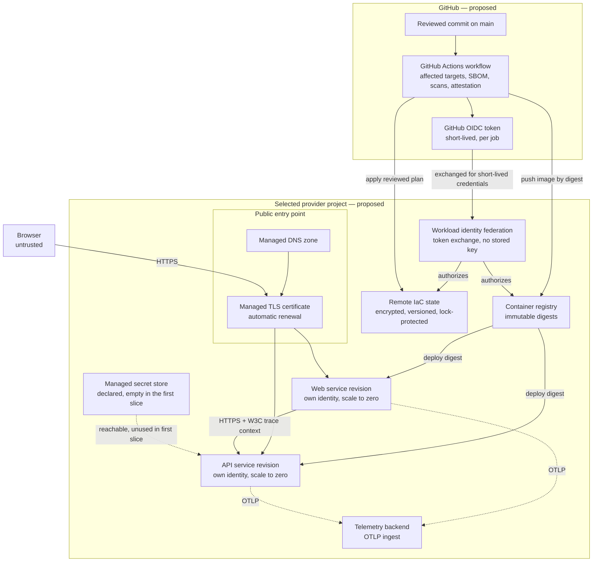
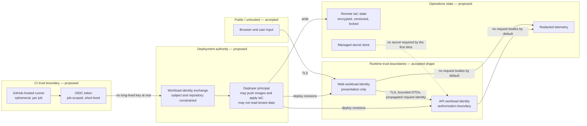
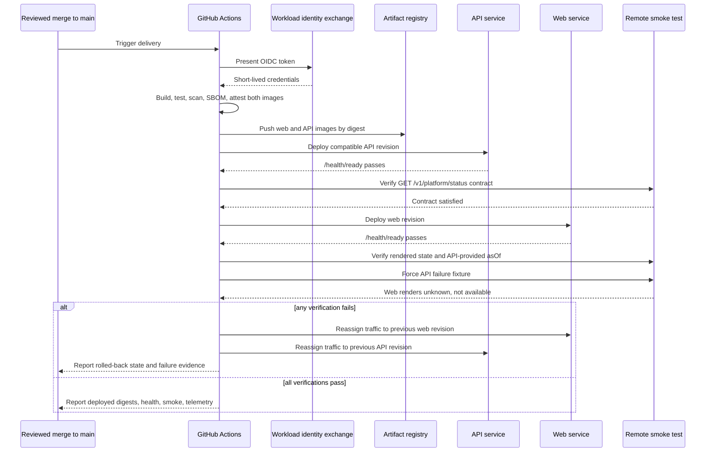

# First remote deployment composition

> **Status:** Proposed
> **Prepared:** 2026-08-29 by `cc-deployment-composition` (harness `claude-code`)
> **Scope:** The first standing remote composition that runs the accepted `apps/web` and `services/platform-api` OCI artifacts in production
> **Related plan:** GitHub issue #2, child work item #7
> **Depends on:** [`../architecture/overview.md`](../architecture/overview.md), [`ADR-0003`](../architecture/decisions/ADR-0003-first-slice-runtime-and-deployment.md)
> **Proposes:** [`ADR-0004`](../architecture/decisions/ADR-0004-first-remote-hosting-composition.md), [`ADR-0005`](../architecture/decisions/ADR-0005-delivery-trust-and-secret-custody.md), [`ADR-0006`](../architecture/decisions/ADR-0006-infrastructure-as-code-and-remote-state.md), [`ADR-0007`](../architecture/decisions/ADR-0007-first-telemetry-backend.md)

**Nothing here is accepted, and no provider account, project, resource, credential, domain, or billing relationship was created, inspected, or modified while preparing it.** This is a paper comparison built from published vendor documentation. Every quantitative claim is an **estimate** computed from **dated published list prices** against **assumed** workload parameters; none of it is measured, and no remote baseline exists yet.

## What must be decided

[`ADR-0003`](../architecture/decisions/ADR-0003-first-slice-runtime-and-deployment.md) accepted two independently deployable OCI images and deliberately left the provider composition open. The first slice therefore cannot be deployed until the following are chosen together, because they constrain one another:

| Element | Why it cannot be deferred |
| --- | --- |
| Hosting runtime | Determines whether idle cost exists, how rollback works, and what the artifact contract must satisfy |
| Container registry | Must be readable by the runtime's workload identity and writable by CI without a long-lived key |
| Public DNS and TLS | The production entry point for `web`; also fixes the API origin the web is configured with |
| GitHub Actions → provider trust | Decides whether the pipeline holds a long-lived cloud key at rest |
| IaC tool and remote state backend | Decides where mutable infrastructure state lives and how concurrent applies are serialised |
| Managed secret store | Must exist before any capability that needs a credential, even though the first slice needs none |
| Telemetry backend | Must accept OpenTelemetry from both deployments and separate their service identities |
| Verification and rollback | Independent per-deployment rollback is an accepted quality attribute, not an optional extra |

## Technology-neutral requirements

These are derived from [`../architecture/principles.md`](../architecture/principles.md), [`delivery.md`](delivery.md), [`../architecture/data-identity-observability.md`](../architecture/data-identity-observability.md), and the accepted overview. They are stated before any provider is named so that the comparison is falsifiable.

| ID | Requirement | Source | Measurable criterion |
| --- | --- | --- | --- |
| R1 | Run a provider-portable OCI image without altering application code | ADR-0003 | The same image digest built in CI runs unmodified in production |
| R2 | Web and API deploy, scale, and roll back independently | overview, ADR-0001 | Rolling back one service leaves the other's running revision untouched |
| R3 | No resident multipurpose service; prefer scale-to-zero or short-lived execution | `principles.md` | Idle cost at zero traffic is bounded and stated |
| R4 | CI authenticates without a long-lived cloud key at rest | `delivery.md` "Prefer short-lived workload identity and CI federation over long-lived cloud keys" | GitHub Actions obtains provider credentials from an OIDC token exchange; no provider secret is stored in GitHub |
| R5 | Each deployment has its own least-privilege workload identity | overview quality attributes | Web's identity cannot read API-only resources and neither can write the registry |
| R6 | Immutable, attributable, attested artifacts deployed by digest | `delivery.md` | Deployment references `sha256:` digests, not mutable tags |
| R7 | Mutable infrastructure state is remote, encrypted, versioned, backed up, and lock-protected | `delivery.md` "Secrets and infrastructure" | Two concurrent applies cannot both write state |
| R8 | Operational secrets have a durable managed source of truth | `delivery.md` | A named managed secret store exists and is reachable by workload identity, even while unused |
| R9 | Vendor-neutral OpenTelemetry collection with a replaceable backend | `data-identity-observability.md` | Both services export OTLP; swapping backends changes configuration only |
| R10 | Production is the only standing environment; CI may create ephemeral resources | `delivery.md` | No persistent staging is required or provisioned |
| R11 | Public TLS on a maintainer-owned domain, automatically renewed | overview trust boundaries | Certificate issuance and renewal require no scheduled human action |
| R12 | Deployment verifies readiness, contract, and forced-failure behaviour, and rolls back automatically when safe | overview "Pipeline" | A failed smoke test restores the previous revision without a human step |
| R13 | Cloud-specific composition is acceptable; cloud-specific domain logic is not | `principles.md` | `infra/` holds all provider coupling; no provider SDK appears in `apps/` or `services/` inner layers |
| R14 | Cost at first-slice scale is bounded, attributable, and observable before it grows | `data-identity-observability.md` | A budget alert exists and per-element cost is enumerated in advance |

R4 and R11 are the two requirements that actually separate the candidates. Everything else is satisfiable by all of them.

## Decision criteria and weighting

| Criterion | Weight | Rationale |
| --- | --- | --- |
| Credential posture (R4, R5) | Highest | A long-lived cloud key in a CI system is the single largest standing compromise path for a platform that will later hold funded authority |
| Independent rollback fidelity (R2, R12) | High | Accepted quality attribute; the first slice exists partly to prove it |
| Production-ready public entry point (R11) | High | A preview-stage or manually renewed TLS path is not a production entry point |
| Bounded, predictable idle cost (R3, R14) | Medium | The first slice has near-zero traffic and must not accrue surprise spend |
| Provider surface consolidation | Medium | Fewer providers means fewer trust boundaries, bills, and audit scopes |
| Portability and exit cost (R1, R13) | Medium | Both candidates run the same OCI artifacts, so exit cost is composition-level, not code-level |
| Data residency control | Open | Cannot be weighted until the maintainer states a residency position |

## Compositions compared

Two compositions are compared in full. Three further options were considered and eliminated with reasons and evidence in [Eliminated options](#eliminated-options); they are not padded into the comparison.

### Composition A — Google Cloud, Cloud Run

| Element | Selection |
| --- | --- |
| Runtime | Cloud Run services, **request-based billing**, min instances 0, one service per deployable project |
| Registry | Artifact Registry, same region |
| DNS and TLS | Cloud DNS managed zone plus a global external Application Load Balancer with a Google-managed certificate and serverless NEG backends |
| CI trust | GitHub Actions OIDC → Workload Identity Federation → short-lived tokens; no stored provider key |
| IaC and state | OpenTofu or Terraform, Google Cloud Storage backend with native object locking |
| Secret store | Secret Manager (declared and reachable; zero secrets in the first slice) |
| Telemetry | OTLP to `telemetry.googleapis.com` → Cloud Trace, Cloud Logging, Cloud Monitoring |
| Rollback | Cloud Run revisions with traffic assignment; roll back by pointing 100% of traffic at the prior revision |

### Composition B — Scaleway, Serverless Containers

| Element | Selection |
| --- | --- |
| Runtime | Serverless Containers in one namespace per deployable project, min scale 0 |
| Registry | Scaleway Container Registry (private namespace) |
| DNS and TLS | Scaleway Domains and DNS plus per-container custom domains with automatic Let's Encrypt certificates |
| CI trust | GitHub Actions with a long-lived Scaleway IAM application API key stored as a GitHub secret |
| IaC and state | OpenTofu or Terraform, S3-compatible backend on Scaleway Object Storage with `use_lockfile` conditional-write locking |
| Secret store | Scaleway Secret Manager (declared and reachable; zero secrets in the first slice) |
| Telemetry | OTLP/Prometheus-remote-write/Loki to Scaleway Cockpit (Grafana, Mimir, Loki, Tempo) |
| Rollback | Container revision redeploy by image digest |

## Evidence table

Every figure below was read from the cited primary vendor page on **2026-08-29** unless the page states its own review date, which is then given. Prices are quoted in the currency the vendor publishes; **no currency conversion is performed**, because no dated FX rate was captured and converting would fabricate precision.

### Composition A figures

| Item | Figure | Source | As of |
| --- | --- | --- | --- |
| Cloud Run request-based CPU, active | `$0.000024` per vCPU-second, tier 1 | https://cloud.google.com/run/pricing | 2026-08-29 |
| Cloud Run request-based memory, active | `$0.0000025` per GiB-second, tier 1 | https://cloud.google.com/run/pricing | 2026-08-29 |
| Cloud Run request-based requests | `$0.40` per 1,000,000 | https://cloud.google.com/run/pricing | 2026-08-29 |
| Cloud Run request-based free tier | `180,000 vCPU-seconds`, `360,000 GiB-seconds`, `2 million requests` free per month, aggregated per billing account | https://cloud.google.com/run/pricing | 2026-08-29 |
| Cloud Run instance-based alternative | CPU `$0.000018`/vCPU-s, memory `$0.000002`/GiB-s, free tier `240,000 vCPU-seconds` and `450,000 GiB-seconds` | https://cloud.google.com/run/pricing | 2026-08-29 |
| Cloud Run same-region service-to-service transfer | "There is no charge for data transfer to Google Cloud resources in the same region (for example for traffic from one Cloud Run service to another Cloud Run service)" | https://cloud.google.com/run/pricing | 2026-08-29 |
| Cloud Run internet egress | Premium tier networking rates, "with a free tier of 1GiB free data transfer within North America per month" | https://cloud.google.com/run/pricing | 2026-08-29 |
| Artifact Registry storage | Free `0 gibibyte month to 0.5 gibibyte month`; `$0.000136986` per gibibyte-hour above (≈ `$0.10` per GiB-month at 730 h) | https://cloud.google.com/artifact-registry/pricing | 2026-08-29 |
| Artifact Registry same-location transfer | `$0.00 (Free)` within the same location | https://cloud.google.com/artifact-registry/pricing | 2026-08-29 |
| Cloud DNS managed zone | `$0.000273973` per hour for the first 25 zones (≈ `$0.20`/zone/month at 730 h); "There is no free tier for Cloud DNS" | https://cloud.google.com/dns/pricing | 2026-08-29 |
| Cloud DNS queries | `$0.40` per 1,000,000 regular queries | https://cloud.google.com/dns/pricing | 2026-08-29 |
| Global external ALB forwarding rule | `$0.025 / 1 hour` for the first 5 forwarding rules (≈ `$18.25`/month at 730 h) | https://cloud.google.com/load-balancing/pricing | 2026-08-29 |
| ALB data processing | `$0.008 / 1 gibibyte` inbound and `$0.008 / 1 gibibyte` outbound | https://cloud.google.com/load-balancing/pricing | 2026-08-29 |
| ALB with serverless NEGs | "you will not be charged for serverless outbound data transfer… Cloud Run data transfer charges do not apply to requests passed from an external Application Load Balancer (using serverless NEGs)" | https://cloud.google.com/load-balancing/pricing | 2026-08-29 |
| Cloud Run domain mappings | "Cloud Run domain mappings are in the preview launch stage. Due to latency issues, they are not production-ready and are not supported at General Availability." | https://docs.cloud.google.com/run/docs/mapping-custom-domains | 2026-08-29 |
| Secret Manager | Free to `6` active secret versions and `10,000` access operations per month; `$0.000082192`/version-hour and `$0.03` per 10,000 accesses above | https://cloud.google.com/secret-manager/pricing | 2026-08-29 |
| Cloud Storage Always Free | `5 GB-months` Standard storage, `5,000` Class A and `50,000` Class B operations, in `US-WEST1, US-CENTRAL1, US-EAST1` only | https://cloud.google.com/storage/pricing | 2026-08-29 |
| Cloud Logging | `$0.50/GiB` ingestion, free allotment `First 50 GiB/project/month` | https://cloud.google.com/stackdriver/pricing | 2026-08-29 |
| Cloud Trace | `$0.20/million spans`, free allotment `First 2.5 million spans per billing account` | https://cloud.google.com/stackdriver/pricing | 2026-08-29 |
| Cloud Monitoring | Google Cloud metrics non-chargeable; other ingestion `$0.2580/MiB` after `First 150 MiB per billing account` | https://cloud.google.com/stackdriver/pricing | 2026-08-29 |
| Monitoring uptime checks | `$0.30/1,000 executions` after `1 million executions per Google Cloud project` free | https://cloud.google.com/stackdriver/pricing | 2026-08-29 |
| Workload Identity Federation | Supports "deployment services, such as GitHub and GitLab"; exchanges an external credential for "a short-lived OAuth 2.0 access token"; "eliminates the maintenance and security burden associated with service account keys" | https://docs.cloud.google.com/iam/docs/workload-identity-federation | 2026-08-29 |
| OTLP ingestion | `telemetry.googleapis.com` is the OTLP root endpoint; OTLP trace ingestion "is now the recommended best practice"; OTLP **metric** ingestion is subject to Pre-GA Offerings Terms | https://docs.cloud.google.com/stackdriver/docs/reference/telemetry/overview | 2026-08-29 |

### Composition B figures

| Item | Figure | Source | As of |
| --- | --- | --- | --- |
| Serverless Containers memory | `€0.000002 / GB-s (€0.20 per 100k GB-s)`, free tier `400,000 GB-s` per month per account (Paris) | https://www.scaleway.com/en/pricing/serverless/ | 2026-08-29 |
| Serverless Containers vCPU | `€0.00001 / vCPU-s (€1.00 per 100k vCPU-s)`, free tier `200,000 vCPU-s` per month per account (Paris) | https://www.scaleway.com/en/pricing/serverless/ | 2026-08-29 |
| Serverless Containers request charge | None published — containers are billed on memory and vCPU only | https://www.scaleway.com/en/pricing/serverless/ | 2026-08-29 |
| Serverless Containers billing basis | "billed on a pay-as-you-go basis, strictly on resource consumption (Memory and CPU). You only pay for the computing resources you use, with no upfront provisioning costs or charges for idle capacity." Memory consumption is "obtained by multiplying the memory tier chosen by the container run duration." Ingress/Egress "Free of charge." | https://www.scaleway.com/en/docs/serverless-containers/faq/ | 2026-08-29 |
| Time before scale to zero | `15 minutes`; time before scale down `30 seconds` | https://www.scaleway.com/en/docs/serverless-containers/reference-content/containers-limitations/ | page reviewed 2025-09-17 |
| Container limits | CPU `70 to 6000 mvCPU`; memory `128 to 12228 MB`; concurrency max `80` per instance; max scale `50` instances per container; invocation rate `5000 per second`; HTTP request duration `10 seconds to 60 minutes`; custom domains max `50` per container; recommended image size below `1 GB` | https://www.scaleway.com/en/docs/serverless-containers/reference-content/containers-limitations/ | page reviewed 2025-09-17 |
| Custom domain TLS | "No, you cannot use your own TLS certificates. Scaleway uses Let's Encrypt to generate and automatically renew certificates on your Custom Domains" | https://www.scaleway.com/en/docs/serverless-containers/faq/ | 2026-08-29 |
| Container Registry | Private images `€0.027/GB/month`; intra-regional transfer free; incoming free; public images free up to `75GB` | https://www.scaleway.com/en/pricing/containers/ | 2026-08-29 |
| Domains and DNS | `€0.007 per hour` per domain (≈ `€5.11`/domain/month at 730 h); `5 millions included` queries, then `€0.0005/million` | https://www.scaleway.com/en/pricing/network/ | 2026-08-29 |
| Secret Manager | `€0.04 per version monthly`; access `€0.03 per 10 000 requests`; restoration `€0.01 per secret version restored`; no free tier stated | https://www.scaleway.com/en/pricing/security-and-account/ | 2026-08-29 |
| Object Storage | Multi-AZ Standard `€0.01606/GB /MONTH`; Single-AZ Standard `€0.00803/GB /MONTH`; egress `75GB free every month then €0.01/GB`; requests and ingress "Included" | https://www.scaleway.com/en/pricing/storage/ | 2026-08-29 |
| Object Storage conditional writes | `If-None-Match` and `If-Match` supported on write operations, including `put-object --if-none-match "*"` | https://www.scaleway.com/en/docs/object-storage/api-cli/using-conditional-writes/ | page reviewed 2026-07-03 |
| Cockpit — Scaleway-sourced data | "Scaleway data is collected and available in Cockpit for free. Retention is also free as long as it stays within the default period of 31 days for metrics and 7 days for logs." | https://www.scaleway.com/en/docs/cockpit/reference-content/cockpit-pricing/ | 2026-08-29 |
| Cockpit — custom data | Custom metrics `€0.15 per million samples`; custom logs `€0.35 per GB ingested`; custom traces `€0.35 per GB ingested`; extended retention `€0.002 per GB/day` for logs and traces | https://www.scaleway.com/en/docs/cockpit/reference-content/cockpit-pricing/ | 2026-08-29 |
| Cockpit OTLP | OTLP HTTP trace path `/otlp/v1/traces` at `https://<datasource_id>.traces.cockpit.<region>.scw.cloud`; metrics via Prometheus remote write; logs via Loki-compatible push | https://www.scaleway.com/en/docs/cockpit/how-to/activate-push-traces/ | 2026-08-29 |
| Serverless Containers regions | `fr-par`, `nl-ams`, `pl-waw` | https://www.scaleway.com/en/developers/api/serverless-containers | 2026-08-29 |
| CI authentication pattern | Documented GitHub Actions integration stores a Scaleway API key (`access-key` / `SCW_SECRET_KEY`) as a GitHub repository secret | https://www.scaleway.com/en/docs/tutorials/use-container-registry-github-actions/ , https://www.scaleway.com/en/docs/tutorials/using-secret-manager-with-github-action/ | 2026-08-29 |

### Shared figures

| Item | Figure | Source | As of |
| --- | --- | --- | --- |
| GitHub Actions, private repositories | GitHub Free `2,000` minutes and `500 MB` storage per month; Pro `3,000`/`1 GB`; Team `3,000`/`2 GB`; Enterprise Cloud `50,000`/`50 GB` | https://docs.github.com/en/billing/concepts/product-billing/github-actions | 2026-08-29 |
| GitHub Actions, public repositories | "GitHub Actions usage is free… for public repositories that use standard GitHub-hosted runners" | https://docs.github.com/en/billing/concepts/product-billing/github-actions | 2026-08-29 |
| Standard Linux runner overage | Linux 2-core (x64) `$0.006` per minute; Linux 2-core (arm64) `$0.005`; Linux 1-core (x64) `$0.002` | https://docs.github.com/en/billing/concepts/product-billing/github-actions | 2026-08-29 |

`phairow/money-noodle` is **private**, so Actions minutes are drawn from the plan allowance rather than being free.

## Cost model

### Model inputs — all assumptions, none measured

| Input | Value | Basis |
| --- | --- | --- |
| Month length for hourly SKUs | 730 hours = 2,628,000 s | Standard cloud billing month; Scaleway's own worked example uses 30-day months, which would lower Scaleway's always-on figure by ≈1.4% |
| Web allocation | 1 vCPU, 1 GiB | Assumption for a Next.js standalone server; **not measured** |
| API allocation | 0.5 vCPU, 0.5 GiB | Assumption for a Fastify process serving one read; **not measured** |
| User-driven web requests | 50,000 / month | Assumption for a pre-launch public status page |
| Resulting API requests | 50,000 / month | One upstream call per server-rendered page, per the accepted slice |
| Readiness probe interval | 60 s per service → 43,800 probes/service/month | Assumption; this value is load-bearing for Composition B (see below) |
| Mean web request duration | 250 ms | Assumption; SSR plus one bounded upstream call |
| Mean API request duration | 25 ms | Assumption; in-process read with no I/O |
| Mean probe duration | 5 ms | Assumption |
| Retained image storage | 3 GiB / GB across both repositories | Assumption: ~2 images × several retained digests |
| ALB traffic processed | 4 GiB in + out combined | Assumption |

Derived: **12,719 s** web instance-time, **1,469 s** API instance-time, **13,453.5 vCPU-s**, **13,453.5 GiB-s**, **187,600 requests** per month.

### Composition A monthly estimate

| Line | Estimate (USD) | Note |
| --- | --- | --- |
| Cloud Run compute and requests | 0.00 | 13,454 vCPU-s and 13,454 GiB-s are ≈7.5% and ≈3.7% of the free tier; 187,600 requests are ≈9.4% of it |
| Global external ALB forwarding rule | 18.25 | The dominant cost, and it is fixed regardless of traffic |
| ALB data processing | 0.03 | |
| Artifact Registry (2.5 GiB billable) | 0.25 | |
| Cloud DNS managed zone | 0.20 | |
| Cloud DNS queries | 0.08 | |
| Secret Manager, Cloud Storage state, Logging, Monitoring, Trace, uptime checks | 0.00 | All within stated free allotments at this scale |
| **Total with a production custom domain** | **≈ 18.81** | |
| **Total on `*.run.app` URLs, no ALB** | **≈ 0.53** | Not a production entry point; see [Maintainer decisions](#maintainer-decisions-required) |

### Composition B monthly estimate

Composition B has **two** compute figures because one billing semantic could not be verified.

| Line | Optimistic (EUR) | Pessimistic (EUR) | Note |
| --- | --- | --- | --- |
| Serverless Containers compute | 0.00 | 44.50 | See the unresolved question below |
| Container Registry (3 GB private) | 0.08 | 0.08 | |
| Domains and DNS (1 domain) | 5.11 | 5.11 | No free tier; ≈25× Cloud DNS's zone charge |
| Object Storage (state file) | 0.00 | 0.00 | Sub-gigabyte |
| Cockpit custom telemetry | ~0.10 | ~0.10 | Assumes under 0.3 GB of custom traces and logs; **assumption, not measured** |
| Custom domain TLS | 0.00 | 0.00 | Let's Encrypt, automatic renewal, no charge |
| **Total** | **≈ 5.29** | **≈ 49.80** | |

**The unresolved question:** Scaleway bills memory and vCPU by "container run duration" and states there are "no… charges for idle capacity", but a Serverless Container instance remains alive for **15 minutes** after its last request. If that warm window counts as run duration — and the absence of any per-request charge suggests it might — then a 60-second readiness probe keeps both containers alive 24/7, producing 3,942,000 vCPU-s and 3,942,000 GB-s per month and the €44.50 figure. If it does not, the cost is zero at this scale. **Published documentation does not settle this**, and it cannot be settled without either a Scaleway support answer or a measured spike, neither of which was in scope. Probing less often than every 15 minutes would avoid the risk but would degrade production monitoring, which is itself a cost.

### What starts costing money as this grows

| Growth driver | Composition A | Composition B |
| --- | --- | --- |
| Sustained traffic | Free tier exhausts at ≈180,000 vCPU-s/month across the billing account, then `$0.000024`/vCPU-s | Free tier exhausts at ≈200,000 vCPU-s/month across the account, then `€0.00001`/vCPU-s — roughly 2.4× cheaper per vCPU-second |
| Warm instances for latency | `min-instances` idle CPU and memory at `$0.0000025` each per second | Provisioned warm instances; Functions publish `€0.000017`/GB-s for warm standby, containers' equivalent rate was not located |
| Second and third service | Free tiers are per billing account, not per service, so they are consumed faster | Same; free tiers are per account |
| Telemetry volume | Logging free allotment is generous (50 GiB/project) but trace and custom-metric ingestion is chargeable | Custom traces and logs at `€0.35/GB` become the fastest-growing line once real instrumentation lands |
| Additional environments | Each additional ALB forwarding rule group is another `$0.025`/h | Each additional domain is another `€0.007`/h |
| Egress to browsers | Charged at premium-tier networking rates beyond 1 GiB/month in North America | Free |

**Not verified:** Google Cloud's per-GiB premium-tier internet egress rate was not read from a primary source in this pass, so the "egress to browsers" line for Composition A is qualitative only.

## Non-cost comparison

| Criterion | Composition A (Cloud Run) | Composition B (Scaleway) |
| --- | --- | --- |
| **CI credential posture (R4)** | Workload Identity Federation exchanges the GitHub OIDC token for a short-lived access token. **No provider key is stored anywhere.** | Documented pattern stores a long-lived IAM application API key as a GitHub secret. No OIDC workload-identity exchange for CI was found in Scaleway's IAM documentation. |
| **Production TLS entry point (R11)** | Domain mappings are **Preview and explicitly "not production-ready"**. Production requires a global external ALB at ≈`$18.25`/month. | Per-container custom domains with automatic Let's Encrypt issuance and renewal, **generally available and free**. |
| **Independent rollback (R2, R12)** | Cloud Run revisions are immutable and addressable; rollback is a traffic reassignment to a prior revision, per service, with no rebuild. | Revision redeploy by image digest. Scaleway documents "Versioning and rollback" but the granularity, atomicity, and traffic-shift semantics were **not verified** in this pass. |
| **Idle cost (R3)** | Request-based billing with `min-instances 0` charges only during request handling; idle instances are explicitly not charged. | Ambiguous, as above. This is the single largest unresolved factor. |
| **Provider consolidation** | Adds a **second** provider: `data-identity-observability.md` already accepts Scaleway object storage for historical and analytical data. | Consolidates compute, registry, DNS, secrets, telemetry, and the already-accepted object store under **one** provider, one bill, one IAM model, one audit scope. |
| **Data residency** | Regions on several continents, including EU. Requires an explicit residency decision. | EU-only for Serverless Containers (`fr-par`, `nl-ams`, `pl-waw`). Residency is decided by the platform's shape rather than by policy. |
| **Remote state locking (R7)** | GCS backend has first-class native locking. | S3 backend `use_lockfile` relies on conditional writes, which Scaleway Object Storage documents as supported (page reviewed 2026-07-03). Functional but a newer, less-exercised path. |
| **Telemetry (R9)** | Native OTLP endpoint; **trace** ingestion is the recommended path, **metric** ingestion is Pre-GA. | Cockpit accepts OTLP traces, Prometheus remote write, and Loki push; the backend is Grafana/Mimir/Loki/Tempo, which is an unusually portable target. |
| **Scale ceilings** | Not binding at first-slice scale; substantially higher than B. | Max scale `50` instances and concurrency `80` per instance per container. Not binding for a status page, but it is a real ceiling to revisit. |
| **Exit cost** | Composition-level only. Both run the same OCI images; the coupling lives in `infra/` and in CI, per R13. | Same. Cockpit's Grafana-stack lineage arguably makes telemetry the *easiest* element to move. |

## Proposal

**Adopt Composition A (Google Cloud, Cloud Run), conditional on the maintainer's residency and domain decisions**, on the strength of one criterion above all others: it is the only candidate examined that lets the delivery pipeline authenticate **without a long-lived cloud credential at rest**. `delivery.md` states that preference directly, and a platform whose stated trajectory includes funded trading authority should not establish a standing long-lived key in a CI system as its founding delivery pattern. Revision-based per-service rollback is the secondary reason.

Accept the ALB's ≈`$18.25`/month as the cost of a production-grade public entry point, and treat it as the deliberate price of not shipping on a Preview-stage feature.

### The strongest counterargument to this proposal

**It splits the platform across two providers on day one, and it charges roughly $18 a month for something the other candidate gives away, in exchange for a credential property that could be substantially mitigated on Scaleway anyway.**

Concretely: `data-identity-observability.md` already accepts Scaleway object storage. Composition A therefore establishes a second provider account, a second IAM model, a second bill, and a second audit scope before the platform has a single user — permanently, since the object-storage decision is accepted. Meanwhile, the R4 gap in Composition B is real but not absolute: a narrowly scoped Scaleway IAM application key, restricted to a single project, rotated on a schedule, and read from GitHub's encrypted secret store, is a weaker posture than OIDC federation but is not an unmanaged secret. A maintainer who weights consolidation and EU residency above credential posture should choose Composition B, and that would be a defensible decision rather than a mistake. The proposal above is a judgement about which risk compounds faster, not a demonstration that Composition B fails a requirement.

A second, smaller counterargument: Composition B's compute could genuinely cost **€0** at this scale. If the warm-window billing question resolves in Scaleway's favour, Composition B is both cheaper and simpler, and the comparison shifts materially.

### What would change the proposal

| Finding | Effect |
| --- | --- |
| Scaleway ships OIDC workload-identity federation for CI | Removes the decisive argument; Composition B likely wins on consolidation |
| Cloud Run domain mappings reach GA with production support | Removes ≈`$18.25`/month from Composition A and widens its lead |
| Maintainer requires EU data residency | Does not eliminate A, but materially strengthens B |
| Measured evidence that the Scaleway warm window is billed | Confirms a ≈€44/month floor for B and widens A's lead |
| Measured evidence that it is not billed | Makes B roughly €13/month cheaper than A at first-slice scale |

## Proposed deployment topology

All elements below are **proposed**, not accepted. They refine — and do not replace — the provider-neutral accepted deployment view in [`../architecture/overview.md`](../architecture/overview.md), which remains the authority for boundaries.

## Proposed delivery trust boundaries

The deployer principal is deliberately separate from both runtime identities. It may publish artifacts and change infrastructure; it may not serve requests. Neither runtime identity may write the registry or the IaC state. No identity in this diagram holds funded authority, because none exists in v2.

## Proposed deployment and rollback sequence

Rollback is per service and requires no rebuild, satisfying R2 and R12. Because the contract is deployed API-first and only additively, rolling back the web alone is always safe; rolling back the API alone is safe whenever the contract range is unchanged. A contract-breaking change is out of scope for the first slice by ADR-0002.

## Verification design

| Stage | Check | Failure behaviour |
| --- | --- | --- |
| Pre-deploy | Both images built from one reviewed commit, scanned, SBOM produced, attestation recorded | Halt; nothing is deployed |
| Infrastructure | Reviewed idempotent plan applied through the pipeline with state locked | Halt; state lock released; drift reported |
| API deploy | `/health/live`, then `/health/ready` | Reassign traffic to the previous API revision |
| API contract | `GET /v1/platform/status` returns a schema-valid v1 response with an `asOf` within a declared skew | Reassign traffic to the previous API revision |
| Web deploy | `/health/live`, then `/health/ready` | Reassign traffic to the previous web revision |
| Web integration | Rendered page shows a state and the API-provided source time | Reassign traffic to the previous web revision |
| Negative smoke | With a forced API failure or invalid fixture, the web renders `unknown` | **Halt without rollback** and expose the blocked state: a web that invents `available` is a correctness fault the previous revision may share |
| Telemetry | Traces from both services share one trace ID; both report artifact version | Report as degraded; do not roll back solely for telemetry loss, per the accepted failure rules |

Quantitative latency, availability, and cold-start thresholds are deliberately absent. ADR-0003 requires them to be set from dated remote baseline evidence, and no such evidence exists.

## Eliminated options

These were considered and rejected with reasons, not omitted.

| Option | Evidence | Why eliminated |
| --- | --- | --- |
| **AWS App Runner** | Provisioned container instances bill memory at `$0.007 / GB-hour` continuously — "you pay for the memory provisioned in each container instance… when your application is idle" (https://aws.amazon.com/apprunner/pricing/, as of 2026-08-29) | Contradicts R3. Two services at the modelled 1.5 GB combined allocation floor at ≈`$7.67`/month of pure idle memory before a single request, with no scale-to-zero. Pausing the service to avoid it is not a production operating model. |
| **AWS ECS on Fargate** | Not priced in this pass | Structurally cannot scale to zero for a request-serving service, which contradicts R3 more strongly than App Runner. Eliminated on shape, without a price check. |
| **Azure Container Apps** | Free grant verified: "The first 180,000 vCPU-seconds, 360,000 GiB-seconds, and 2 million requests per subscription per month are free" (https://azure.microsoft.com/en-us/pricing/details/container-apps/, as of 2026-08-29). **Per-second rates could not be verified** — the pricing page rendered every rate as `$-`. | Genuinely credible on capability: scale to zero, free managed certificates on custom domains, GitHub OIDC federated credentials, Key Vault, and blob-lease state locking. Eliminated because its free grant is **identical** to Cloud Run's, so it demonstrates no cost advantage; because it introduces a third provider ecosystem with no existing relationship; and because its current rates could not be established from the primary source today, which fails this document's own evidence standard. **If the maintainer wants a third candidate priced properly, Azure Container Apps is the one to price.** |
| **Fly.io / Render / Railway** | Not priced in this pass | Eliminated on requirements rather than cost: none was found to offer the combination of OIDC workload-identity federation for CI, a managed secret store with documented rotation and revocation, and a lock-protected remote IaC state backend that R4, R7, and R8 require. Revisit only if a specific one demonstrably meets all three. |
| **Managed Kubernetes on any provider** | — | Contradicts `principles.md`'s preference for short-lived isolated execution over resident multipurpose infrastructure, and imposes cluster lifecycle, upgrade, and idle node cost on a two-service status page. Premature by a wide margin. |
| **Provider-native source deployment (build-from-source)** | — | Already rejected by ADR-0003 as the architecture contract. Not reopened. |

## Portability and lock-in

Under R13 the application code carries **no** provider coupling in either composition: both deploy the same OCI image digests, and `apps/web` and `services/platform-api` inner layers import no provider SDK. What is genuinely locked in is the *composition*, and it is worth naming precisely:

| Element | Migration difficulty | Note |
| --- | --- | --- |
| Compute | Low | Same OCI artifact; the change is a deployment target and a scaling configuration |
| Registry | Low | Images are re-pushable; digests are portable |
| DNS | Low, but with a cutover window | Zone records are portable; TTL planning is the only real work |
| IaC modules | Medium | Provider resource blocks are rewritten; module boundaries and variables survive |
| IaC state | Medium | State must be migrated, not just copied; the backend change is mechanical but must be serialised |
| Secret store | Medium | Values must be re-created, never copied through a laptop or a log |
| Telemetry backend | Low to medium | OTLP instrumentation is portable by construction; dashboards, alert rules, and retention policy are not |
| Historical object storage | **Already committed** | Scaleway is accepted in `data-identity-observability.md`; this decision does not revisit it |

Backup and restore for the first slice is narrow, because the slice is stateless: the only durable artefacts are the IaC state object, the image digests, and telemetry. All three must be versioned with tested restore, and the state backend's versioning must be enabled from the first apply, not retrofitted.

## Maintainer decisions required

None of the following can be resolved by an agent, and **no account, project, resource, domain, credential, or billing relationship was created or inspected** in preparing this document.

| # | Decision | Why only the maintainer can make it | Blocks |
| --- | --- | --- | --- |
| M1 | **Which composition**, A or B — or a request to price Azure Container Apps as a third | It is a risk-weighting judgement between credential posture and provider consolidation, and consolidation interacts with the already-accepted Scaleway object-storage decision | Everything below |
| M2 | **Provider account and organisation** ownership, and who holds the root/owner credential | Requires a legal and billing identity, and establishes the platform's ultimate recovery path | All resource creation |
| M3 | **Billing account, payment method, and a monthly budget ceiling** with an alert threshold | Financial commitment; R14 requires a stated ceiling before spend can begin | First apply |
| M4 | **Region**, and whether EU data residency is a requirement or a preference | Policy and legal question; it also narrows or eliminates Composition A's region set and is effectively pre-decided by Composition B | Region-scoped resources; also determines whether Cloud Storage Always Free applies, since it covers only `US-WEST1`, `US-CENTRAL1`, `US-EAST1` |
| M5 | **Domain name ownership** and where the registrar lives | The domain must already be owned; DNS delegation cannot be arranged on the maintainer's behalf | DNS zone, TLS, public entry point |
| M6 | **Public DNS layout** — the hostnames for web and API, and whether the API is publicly reachable at all in the first slice | Product and security decision; the accepted architecture permits a server-side-only API but does not require it | ALB or custom-domain configuration, CORS posture, generated client base URL |
| M7 | **Interim entry point**, if the domain is not ready: ship on default provider URLs, or delay the first remote validation | Trades ≈`$18.25`/month and a production-grade URL against schedule | Whether the ALB is created in the first apply |
| M8 | **GitHub plan**, given that `phairow/money-noodle` is private and Actions minutes are therefore charged against the plan allowance | Financial and account decision | CI budget |
| M9 | Whether to accept **Pre-GA OTLP metric ingestion** in Composition A, or route metrics through a GA path | Risk acceptance on a Pre-GA offering | Telemetry configuration |

## Unresolved constraints and validity threats

| # | Unresolved | Status | Largest risk if wrong |
| --- | --- | --- | --- |
| U1 | Whether Scaleway bills the 15-minute post-request warm window as run duration | **Could not be verified from published documentation.** Needs a Scaleway support answer or a measured disposable spike | Composition B's monthly cost is either €0 or ≈€44.50 for compute — a swing large enough to invert the cost comparison |
| U2 | Whether Scaleway offers, or plans, OIDC workload-identity federation for CI | No such capability found in Scaleway IAM documentation; documented GitHub Actions integrations use a long-lived API key. **Absence of documentation is not proof of absence** | The single decisive argument for Composition A |
| U3 | Scaleway Serverless Containers rollback granularity and atomicity | Documented as "Versioning and rollback" but **not verified** | R2 and R12 compliance for Composition B |
| U4 | Google Cloud premium-tier internet egress rate per GiB | **Not read from a primary source in this pass** | Understates Composition A's cost at higher traffic; immaterial at first-slice scale |
| U5 | Azure Container Apps per-second rates | **Not obtainable** — the primary pricing page rendered all rates as `$-` on 2026-08-29 | A credible third option was eliminated partly on unverifiable data |
| U6 | Scaleway warm-standby rate for *containers* (the published `€0.000017`/GB-s figure is for *Functions*) | **Not located** for containers | Affects any future decision to keep instances warm on Composition B |
| U7 | Actual request durations, memory footprints, and cold-start times for both images | **No image exists yet.** Every compute figure rests on assumed durations and allocations | This is the largest validity threat in the whole document: a 4× error in web request duration or memory allocation changes the compute lines by 4×. At first-slice scale both compositions stay inside their free tiers even under a 10× error, so the *ranking* is robust even though the *numbers* are not |
| U8 | Whether the first slice's API is public | Depends on M6 | Changes the entry-point design and possibly the ALB rule count |

### Honest labelling of this document

- **Facts:** the quoted prices, limits, free tiers, and capability statements, each with a source URL and an as-of date.
- **Estimates:** every monthly total, all derived from assumed workload parameters against those prices.
- **Hypotheses:** U1 and U2 — the two questions that most affect the outcome.
- **Simulation:** none. No workload was simulated.
- **Realized results:** none. Nothing has been deployed, measured, or validated remotely.

**As-of time:** 2026-08-29. **Sample:** published vendor list pricing pages for the regions named, retrieved once. **Exclusions:** taxes, VAT, support plans, committed-use discounts, free-trial credits, currency conversion, domain registration fees, and any private or negotiated pricing. **Uncertainty:** compute figures carry the full uncertainty of U7; fixed monthly lines are firm to the published rate but assume a 730-hour month. **Largest validity threat:** no artifact, no measurement, and no remote baseline exists, so every duration and allocation input is an assumption made before the code it describes has been written.
