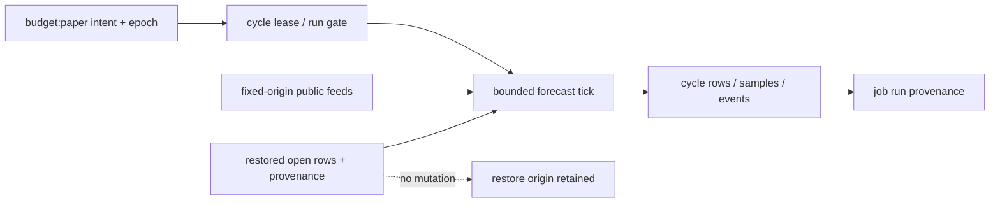

# Forecast-only cycle lane

Stage 2 of #243 adds the forecast lane to the existing [engine-cycle frame](engine-cycle.md). This is code availability, not activation. The schedule remains paused and committed mode remains dry. Paper execution and deployed staged-start evidence remain stages 3–4.

The lane requires schema-owner migration 0005; no runtime applies it. Later explicitly authorized activation must reconcile the restored seed, apply the migration through the schema-owner path, raise both control epochs for the schema event, and establish fresh persisted paper intent. This PR performs none of those effects.

Each tick reads persisted paper provider permissions, obtains public inputs, records qualified 15-second or unqualified minute observations, then resolves a bounded set of due rows. Production probability never reads performance, candidates, promotions or venue prices. Asks influence entry research only. Resolution uses the issuance venue and contract; unavailable, mismatched or unsupported results cannot substitute another venue.

The applied reason is forecast-run. Dry-run is unchanged and paper remains mode-not-implemented. An expired writer cannot mutate forecasts; an opened run stays spent for retry/recovery evidence.

## Store topology

The unique asset/close cycle groups all observation identities. Overlay reads suppress the corresponding seed, preserving restoration without duplicate visible identities. New rows carry cycle-run origin; seeded overlays retain restore origin plus current mutation provenance.

See [stage-2 qualification](../validation/2026-10-10-forecast-stage2.md) for test boundaries, retention/diagnostic limitations and exact-head acceptance requirements.

## Authority and explicitly versioned adaptations

The current API's `services/platform-api/src/domain/budget-control.ts` documents provider-enable as an inert audited request until a funded-authority design exists. Its configure payload validates bounded scalar syntax, not a forecast provider/research policy schema. ADR-0013 fixes reading persisted pause/resume and epoch at the start of the run; it does not define a new forecast-config materializer. This lane therefore does not interpret configure/provider-enable scalars as provider execution or research authority. Restored paper provider flags only narrow which public-data observational targets are acquired after the current run gate; they do not grant authority to run, execute, or promote a model. No zero-budget research prohibition or live flag is inferred.

Candidate probability-family math retains the historical model descriptors, but public-quote entry eligibility and Kalshi-only observations are explicitly `observation-v2` research adaptations, not unchanged historical funded-capability-narrowed candidate identities. The candidate evaluation stamps its registry, source, enabled research venues, policy and complete decisions. It is never consumed by the production probability, funded capability or promotion path.

**Contract question retained for independent review:** does accepted stage-2 paper-seam scope permit Kalshi-only recording and both-public-venue entry observations under these new observational identities, or must recording/candidate eligibility remain historically narrowed? No accepted source inspected explicitly settles that adaptation. This PR does not claim historical tracking parity for it. If strict parity is required, narrow recording/eligibility before review readiness; do not import live-capability flags or activate anything to answer it.

Issuance calibration uses compatible `calibration-replay-v1` fields, finite raw basis inputs and independently recomputed confidence/probability errors. Historical reconstruction never fabricates missing raw or confidence inputs. Non-control research candidates require issuance-exact probability and confidence replay errors at most 1e-12. Archived promotions remain inert.
