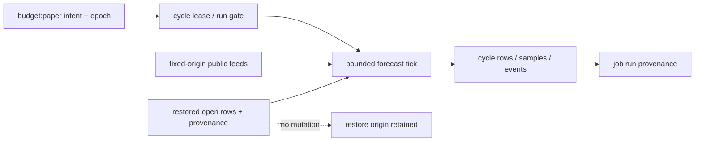

# Forecast-only cycle lane

Stage 2 of #243 adds the forecast lane to the existing [engine-cycle frame](engine-cycle.md). This is code availability, not activation. The schedule remains paused and committed mode remains dry. Paper execution and deployed staged-start evidence remain stages 3–4.

The lane requires schema-owner migration 0005; no runtime applies it. Later explicitly authorized activation must reconcile the restored seed, apply the migration through the schema-owner path, raise both control epochs for the schema event, and establish fresh persisted paper intent. This PR performs none of those effects.

Each tick reads persisted paper provider permissions, obtains public inputs, records qualified 15-second or unqualified minute observations, then resolves a bounded set of due rows. Production probability never reads performance, candidates, promotions or venue prices. Asks influence entry research only. Resolution uses the issuance venue and contract; unavailable, mismatched or unsupported results cannot substitute another venue.

The applied reason is forecast-run. Dry-run is unchanged and paper remains mode-not-implemented. An expired writer cannot mutate forecasts; an opened run stays spent for retry/recovery evidence.

## Store topology

The unique asset/close cycle groups all observation identities. Overlay reads suppress the corresponding seed, preserving restoration without duplicate visible identities. New rows carry cycle-run origin; seeded overlays retain restore origin plus current mutation provenance.

See [stage-2 qualification](../validation/2026-10-10-forecast-stage2.md) for test boundaries, retention/diagnostic limitations and exact-head acceptance requirements.
