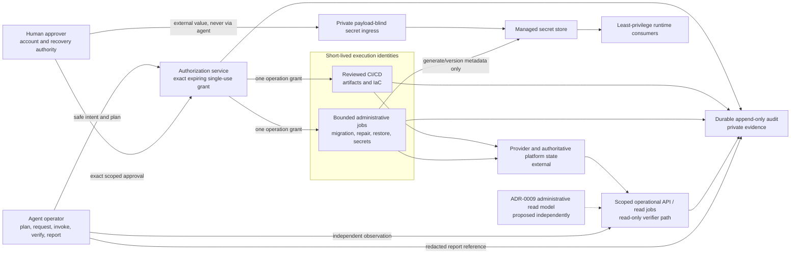

# Production operation control plane and catalog

> **Status:** Proposed for maintainer acceptance; not implemented authority
> **Catalog ID:** `money-noodle.production-operations`
> **Catalog version:** `1`
> **Prepared:** 2026-08-30 under GitHub issue #20
> **Owning decision:** [`ADR-0010`](../architecture/decisions/ADR-0010-agent-operated-production-control-plane.md)
> **Related authority:** [`delivery.md`](delivery.md), [`../architecture/data-identity-observability.md`](../architecture/data-identity-observability.md)

This document is the normative catalog for routine production operations. It designs machine-readable control surfaces; it does not create one. No Google Cloud resource, production deployment, operational secret, agent credential, or real-money authority currently exists.

## Invariants and actors

Humans retain account and billing ownership, recovery, break-glass custody, and explicit scoped approval of production effects. Agents are the intended technical operators: they plan, request approval, initiate execution, observe, independently verify, and report. Short-lived workloads execute. These are separate roles even when one platform coordinates the handoff.

| Actor | Responsibility | Must not do |
| --- | --- | --- |
| Human approver | Accept one bounded production effect or an exact scheduled charter; retain account/recovery authority | Delegate approval implicitly, disclose secret payloads, approve an unbounded shell |
| Agent operator | Prepare intent/plan, request a grant, invoke an allowlisted interface, verify through a read path, report redacted evidence | Approve, merge without instruction, hold a durable credential, receive a secret payload, improvise a provider command |
| Authorization service | Validate permission and bind a grant to exact operation inputs, plan, state, expiry, nonce, and recovery | Broaden scope after approval or treat authentication as approval |
| Execution workload | Use one purpose-specific short-lived identity to perform the granted operation | Reuse the grant, exceed catalog effects, approve, expose credentials or values |
| Verification reader | Observe authoritative application/provider state with read-only permission independent of executor output | Infer success from workflow exit status or mutate while verifying |
| Audit writer/store | Append linked request, decision, execution, effect, verification, and recovery records | Sample, overwrite, or use disposable telemetry as the record |
| Runtime consumer | Read only its declared active secret versions and refresh as specified | List unrelated secrets, read OpenTofu state, expose values in health or telemetry |

No browser, issue, prompt, repository file, commit metadata, Actions log/summary/artifact/cache, OpenTofu plan/state, or agent-visible process context carries a secret payload, durable provider credential, account/billing identifier, production snapshot, private recovery material, or unredacted incident evidence.

## Execution and approval model

### Surfaces

| Code | Surface | Boundary |
| --- | --- | --- |
| `CD` | Reviewed CI/CD | Immutable artifact publication/deploy/rollback and source-controlled infrastructure/configuration. Federated identity, protected `main`, serialized per state/target. |
| `AJ` | Bounded administrative job/API | Schema-validated, non-interactive operation with fixed maximum effects, timeout, retry, checkpoint, and purpose-specific identity. No arbitrary shell or generic provider proxy. |
| `OA` | Scoped operational API/read job | Read-only, redacted application/provider observations. Server authorization on every request; provider integration remains outside browser and request-serving inner layers. |
| `SI` | Private payload-blind secret ingress | Direct person/provider-to-managed-store data path. Orchestration sees lifecycle status only. |
| `HX` | Human exception | Initial trust-root bootstrap or break-glass only; time-bounded where possible and reconciled into code/state. |

### Approval classes

| Code | Meaning |
| --- | --- |
| `R0` | Standing read permission at an exact scope; no one-time production-effect approval. Sensitive export and privileged read remain separately authorized and evidenced. |
| `H1` | Single-use human grant for one exact production effect, including a sensitive export. A protected-branch review/merge may supply this only for the exact automatic forward deploy it identifies; any configured environment gate still applies. |
| `H2` | Single-use high-consequence human grant after recovery readiness and a fresh plan are proven. Used for restore, destructive migration, secret revocation, access, cost ceiling, and DNS/certificate change. |
| `SC` | Human-approved versioned schedule/reconciliation charter. Each conforming invocation needs no live approval; changing scope, code, cadence, identity, limits, or effects needs a new `H1` grant. |
| `HB` | Human-only bootstrap or break-glass authority. Never an agent credential or standing routine grant. |

A mutation grant contains: grant and request IDs; catalog ID/version and operation ID; environment; tenant/resource targets; requester and approver principals; executor identity class; safe normalized parameters or their digest; source/artifact/plan digest; expected resource/config/schema versions; allowed effects and maximum cardinality; idempotency key; concurrency/lease scope; issued/not-before/expiry times; single-use nonce; verification contract; rollback or forward-recovery contract; and reason/change reference. Raw values, credentials, provider state, account identifiers, and secret material are excluded.

The authorization service compares this envelope with current policy and state immediately before token exchange and again before commit where an operation has phases. Authentication, repository write access, a green plan, an issue assignment, or a previous grant is never approval. The executor cannot widen a target set or substitute a new plan after approval.

### Catalog completeness and versioning

`money-noodle.production-operations/v1` is an allowlist. An interface rejects an unknown operation ID, catalog version, field, target type, or effect. A new routine read or mutation requires a reviewed catalog version, compatible machine-readable schema, purpose-specific permissions, negative tests, and an implementation/rollback transition. Removing or narrowing an operation is compatible after callers have migrated; broadening effects, approval, identity, or target semantics requires a new catalog version.

The tables below cover the known routine classes. In the **Evidence** column, `AE` means the durable operation audit envelope defined later; `RA` means an authorized read/access record and trace. Public reports contain only safe evidence references.

## Version 1 operation coverage matrix

### Read and diagnostic operations

| Operation ID | Read or mutation | Surface | Authority / approval / identity | Idempotency and concurrency | Verification | Recovery or failure behavior | Evidence |
| --- | --- | --- | --- | --- | --- | --- | --- |
| `status.read` | Read | `OA` | Platform/user status permission; `R0`; API/read identity | Cache validator and bounded polling; no mutation | Source/as-of and safe artifact/schema version | Return stale/unknown, never invented healthy | `RA`; response source/as-of |
| `deployment.read` | Read | `OA` | Platform operations; `R0`; deployment reader | Version cursor; bounded provider/read-model fan-out | Compare desired commit/digest/config with observed revision | Mark partial/stale/unknown; no inline repair | `RA`; compared versions |
| `infrastructure.plan` | Read/plan | `CD` | Platform operations; `R0` to request; planner identity cannot apply | State lock or consistent snapshot; plan keyed by source/state digest | Re-plan from same source and state | Redact and discard stale plan; never treat plan as approval | `RA`; plan digest, source/state versions |
| `drift.read` | Read | `CD` or `OA` | Platform operations; `R0`; read-only drift identity | Per-stack serialized refresh; schedule overlap denied | Compare reviewed desired state with provider-observed state | Report only; unknown on provider failure | `RA`; diff digest and as-of |
| `telemetry.diagnose` | Read | `OA` | Debug access at exact tenant/platform scope; `R0`; telemetry reader | Bounded time/query/cardinality and export size | Correlate independent signals; preserve unknown | Redact; deny cross-scope; private incident path for sensitive evidence | `RA`; query bounds; export gets `AE` |
| `incident.state.read` | Read | `OA` | Platform operations or scoped user status; `R0`; incident reader | Versioned incident cursor | Compare incident state and source/as-of | Return unavailable/unknown without exposing exploit detail | `RA` |
| `cost.read` | Read | `OA` | Billing/ownership; `R0`; cost reader distinct from deployer | Versioned read model; bounded refresh | Source/as-of and reported-versus-derived label | Missing is unknown, never zero | `RA`; source/as-of |
| `job.state.read` | Read | `OA` | Job/data operations at exact scope; `R0`; job-state reader | Version/checkpoint cursor; bounded history | Compare schedule, invocation, lease, migration, repair and reconciliation state | Mark stale/blocked/unknown; no inline retry or repair | `RA`; charter/invocation/checkpoint versions |
| `data.quality.read` | Read | `OA` | Data operations at exact tenant/resource scope; `R0`; quality reader | Bounded dataset/version cursor | Source/as-of, rule version, sample and exclusions | Unknown/invalid remains distinct from zero/healthy | `RA`; rule/result versions |
| `backup.read` | Read | `OA` | Data operations at exact scope; `R0`; backup inventory reader | Consistent inventory cursor | Check recency, integrity, failure domain, restore-test status | Mark recovery unavailable and block dependent mutations | `RA`; inventory/check timestamps |
| `workload.access.read` | Read | `OA` | IAM/security permission at exact scope; `R0`; policy reader | Policy version cursor; bounded effective-access expansion | Compare declared and effective grants; run excessive-scope checks | Unknown policy fails closed for dependent mutations | `RA`; policy version and check results |
| `secret.metadata.read` | Read, no payload | `OA` | Secret lifecycle permission; `R0`; metadata-only identity | Version cursor; list bounds | Compare owner, consumers, lifecycle state, due dates | Payload endpoint does not exist; deny unknown scope | `RA`; no value/hash/derived verifier |
| `operation.evidence.read` | Read | `OA` | Audit/platform/security permission at exact scope; `R0`; audit reader | Immutable cursor and bounded chain traversal | Verify tamper-evident chain/signature and causation links | Unavailable evidence is unknown and blocks claims of verified success | `RA`; access decision and chain verification |
| `operation.evidence.export` | Sensitive read/export | `AJ` | Audit/security export permission; `H1`; bounded export identity | Export request ID; fixed query digest, size and expiry | Re-read manifest/count/checksum through separate audit reader | Revoke access and destroy expired export; never publish privately scoped content | `AE`; query/manifest digest, recipient scope, expiry |

### Delivery, infrastructure, and data operations

| Operation ID | Read or mutation | Surface | Authority / approval / identity | Idempotency and concurrency | Verification | Recovery or failure behavior | Evidence |
| --- | --- | --- | --- | --- | --- | --- | --- |
| `service.deploy` | Mutation | `CD` | Deploy permission; `H1` (exact protected merge may be grant); federated per-service deployer | Artifact digest + target idempotency; per-service serialized rollout | Independent health, contract, artifact/config and smoke reads | Automatic prior-revision rollback when safe; otherwise block/reconcile | `AE`; commit, digest, plan, revision, checks |
| `service.rollback` | Mutation | `CD` | Deploy/recovery permission; `H1`; federated per-service deployer | Target prior revision; serialized per service; replay returns current state | Readiness, contract, traffic and artifact observation | Forward-recover to known digest if prior revision unavailable | `AE`; from/to revisions and reason |
| `infrastructure.apply` | Mutation | `CD` | Infrastructure permission; `H1`, or `H2` for destructive effects; federated stack deployer | Saved-plan digest; state lock; serialized per stack; nonce | Re-plan equality plus drift/provider observation | Provider-specific compensation or reconcile; never blind re-apply | `AE`; source/state/plan digests and effects |
| `configuration.change` | Mutation | `CD` | Configuration permission; `H1`; configuration deployer | Expected config version; serialized per owner | Read deployed config version and behavior | Roll back compatible config or forward-recover | `AE`; redacted before/after versions |
| `schema.migrate` | Mutation | `AJ` invoked by `CD` | Schema owner; `H1`, `H2` if destructive; migration identity | Migration ID; single owner; DB lock/fencing; resume checkpoints | Schema version, compatibility and data-quality queries | Expand/contract rollback or declared forward recovery; restore only if tested | `AE`; migration/checkpoint/version results |
| `schedule.change` | Mutation | `CD` | Job operations; `H1`; scheduler configurator | Expected schedule version; serialized per schedule | Read active cadence, limits, identity, code version | Restore prior schedule or disable safely | `AE`; before/after charter |
| `schedule.run` | Mutation | `AJ` | Approved `SC`; purpose-specific job identity | Invocation/idempotency key; partition lease/fence; overlap policy | Output checkpoint, invariants and downstream observation | Retry boundedly, reconcile uncertain effects, terminal cleanup | `AE`; charter version, invocation, effects |
| `reconciliation.run` | Mutation/read-repair | `AJ` | Data/platform operations; `SC` within auto-repair allowlist, otherwise `H1`; reconciler identity | Scope cursor, idempotent repairs, lease/fence | Compare intended, recorded, provider-observed state after repair | Ambiguity fails closed for administrative review | `AE`; mismatches, allowed repairs, unresolved items |
| `repair.execute` | Mutation | `AJ` | Scoped repair permission; `H1`; repair identity | Exact targets and expected versions; per-target fence | Re-read invariants and external effects | Compensation or freeze/block pending review | `AE`; reason, targets, before/after versions |
| `backup.create` | Mutation | `AJ` | Data operations; `SC` or `H1`; backup identity | Backup ID and source checkpoint; one active per source class | Integrity/checksum, inventory, encryption, failure-domain check | Retry/resume; alert and mark recovery unavailable | `AE`; backup reference, class, integrity, as-of |
| `restore.execute` | Mutation | `AJ` | Data recovery permission; `H2`; isolated restore identity | Restore ID; exclusive target fence; exact backup/version | Integrity plus application/schema and sampled/full invariant checks | Revert target or forward-recover per tested runbook; block if no safe path | `AE`; grant, backup reference, RPO/RTO observations |
| `drift.reconcile` | Mutation | `CD` | Infrastructure permission; `H1`; federated stack deployer | Fresh reviewed plan; state lock; serialized stack | Provider observation and clean follow-up drift read | Roll back/reconcile; never silently auto-correct from scheduled read | `AE`; prior drift and resulting state |

### Secret, access, incident, cost, and domain operations

| Operation ID | Read or mutation | Surface | Authority / approval / identity | Idempotency and concurrency | Verification | Recovery or failure behavior | Evidence |
| --- | --- | --- | --- | --- | --- | --- | --- |
| `secret.container.create` | Mutation, metadata only | `CD` | Secret administration; `H1`; metadata/IAM deployer with no value access | Stable secret contract ID; state lock; one owner | Container policy, owner and no-value-access negative check | Remove empty container or reconcile policy | `AE`; metadata/policy versions only |
| `secret.version.generate` | Mutation, payload internal | `AJ` | Secret lifecycle permission; `H2`; generator can add one version but cannot reveal/list values | Rotation request ID; per-secret lease; no retry after ambiguous write without reconcile | Version lifecycle state and consumer canary, never value/hash | Reconcile ambiguous create; revoke failed version; regenerate | `AE`; opaque version reference and state only |
| `secret.version.ingress` | Mutation, external payload | `SI` + `AJ` | Human/provider supplies payload; `H2` authorizes lifecycle; ingress identity writes one bound secret/version | One-time ingress token bound to secret/request, expiry and single use | Receipt plus consumer canary; orchestrator sees no payload | Destroy rejected/pending version; request fresh ingress, never retrieve | `AE`; receipt/status only; private ingress audit |
| `secret.rotate` | Mutation | `AJ` | Secret lifecycle permission; `H2`; rotation orchestrator plus consumer-specific identities | Per-secret lease; phase checkpoints; one active rotation | Every declared consumer acknowledges new version and functional canary passes | Keep old version active during overlap; abort/revoke new on failure | `AE`; phase/consumer states, no payload |
| `secret.revoke` | Mutation | `AJ` | Secret lifecycle/recovery permission; `H2`; revoker identity | Exact version/access target; per-secret lease; replay reports revoked | Access denial plus consumer health/recovery validation | Block if replacement/recovery unavailable unless incident break-glass grant explicitly accepts outage | `AE`; reason, impact, denial checks |
| `secret.consumer.refresh` | Mutation | `AJ` or `CD` | Workload operations; `H1`, or phase of approved rotation; consumer deployer | Expected config/secret version; per-consumer serialization | Runtime reports safe active-version reference and canary | Roll back consumer or keep overlap; never log value | `AE`; consumer and version references |
| `workload.access.change` | Mutation | `CD` | IAM/security permission; `H2`; policy deployer cannot use granted access | Fresh policy plan; expected policy version; serialized resource | Effective-access positive and excessive-scope negative tests | Revoke grant and reconcile; fail closed on unverifiable policy | `AE`; policy diff, tests, expiry if temporary |
| `telemetry.configuration.change` | Mutation | `CD` | Platform/debug administration; `H1`; telemetry configurator | Expected config version; serialized owner | Signal flow, redaction marker absence, retention/cost observation | Restore prior config; telemetry loss is degraded, not silent | `AE`; config versions and redaction test |
| `incident.mitigation.execute` | Mutation | `AJ` or `CD` | Platform operations; `H1`, `H2` when data/access/destructive; mitigation identity | Incident + action idempotency key; target fence | Independent symptom and invariant checks | Roll back, reconcile, or escalate to break-glass | `AE`; incident/action/effect chain |
| `cost.control.change` | Mutation | `CD` | Billing/ownership; `H2`; budget-policy deployer without payment authority | Expected policy version; serialized budget scope | Read effective ceiling/alerts and notification test | Restore prior policy; never detach billing or auto-shutdown implicitly | `AE`; redacted policy versions and test |
| `dns.certificate.cutover` | Mutation | `CD` | Domain ownership + platform operations; `H2`; DNS/certificate deployer | Change set ID; zone lock; TTL/certificate preconditions | Authoritative DNS, TLS chain/renewal, web/API smoke from independent probes | Time-bounded record rollback and prior route retained until verified | `AE`; change set, observations, rollback window |

## Independent verification and terminal states

Execution and verification use different evidence sources and permissions. The same agent may coordinate both, but the verification call cannot use the mutation token or trust executor-produced success text. At minimum it reads authoritative application state and, where an external effect exists, provider-observed state. It compares intent, audit record, and observation without relying on timestamp ordering alone.

Terminal states are `verified`, `rolled-back-and-verified`, `recovered-and-verified`, `unverified`, `blocked`, or `failed`. `completed` is not a terminal production result. An unavailable verifier leaves the result `unverified` and invokes the cataloged safe response. Quantitative evidence includes as-of time, sample, exclusions, uncertainty, and largest validity threat.

## Audit and evidence contract

The audit system is durable, append-only, access-controlled, tamper-evident, and never sampled. It is separate from logs, traces, job summaries, and the operational read models proposed elsewhere.

Each operation chain records, as applicable:

- event ID, event/ingestion UTC times, catalog ID/version, operation and phase;
- request and grant IDs, requester, human approver, execution workload, verifier, tenant/resource scope, reason, grant expiry and policy version;
- source commit, artifact, normalized-input, plan, expected-state and authorization digests;
- idempotency key, lease/fencing generation, attempt, checkpoints, and causation/parent/correlation IDs;
- safe target classes, before/after versions, declared maximum and realized effect counts, outcome and stable error class;
- external request/resource references in the private audit domain, never public provider/account identifiers;
- verification source/as-of, intended-recorded-observed comparison, recovery action, terminal state, and residual uncertainty.

The authorization decision is appended before token exchange. Each external effect and recovery action is appended around its commit boundary. Where a provider call and audit append cannot be atomic, the job uses a durable intent/outbox and reconciliation; it does not claim distributed exactly-once execution.

A public issue/checkpoint, commit status, or Actions summary may report catalog/operation version, safe source/artifact/plan digests, terminal state, check names, redacted timestamps, and an opaque evidence reference. It must not contain raw plans/state, secret identifiers or values, account/billing/provider identifiers, tenant/customer data, private incident detail, recovery material, or a URL/token that grants audit access. Evidence access itself is scoped and attributable.

If required audit storage is unavailable before a consequential mutation, execution does not start. If append fails after an uncertain external effect, the operation freezes further work, preserves its durable intent/checkpoint, and enters reconciliation; it never retries blindly or reports success.

## Secret lifecycle without payload exposure

### Secret contract

Before a first value exists, non-secret metadata defines a stable internal contract ID, owning capability/person, classification, source type (`provider-generated` or `external`), consuming workload identities and exact versions/aliases allowed, rotation interval and overlap, refresh/canary behavior, revocation trigger, regeneration or re-ingress recovery, and evidence retention. Public source may define generic contracts, but account-specific names and opaque managed-store references remain in private operational configuration/audit.

OpenTofu owns containers, IAM, lifecycle policy, and references only. It must not own a version resource whose create/read path puts the payload in configuration, plan, state, output, or provider debug logs. A policy test rejects secret-value variables, outputs, data sources, command arguments, summaries, and artifacts.

### Creation and secure ingress

- **Provider-generated:** a bounded job asks the provider/approved generator to generate and write directly to one pending managed-store version. The value never returns through the operation response. The generator has add-version authority for one contract and no value-read or policy-admin authority.
- **Externally supplied:** after `H2` approval, the system issues a short-lived, single-use ingress capability bound to one secret contract and request. The person or external provider submits over the private ingress directly to the managed store. The agent, workflow dispatcher, shell, issue, and OpenTofu process receive only receipt and lifecycle status. Until this surface is implemented, direct human entry into the provider's protected secret interface is an explicit payload-ingress exception, not routine technical operation, and is privately audited.

Reject size/format/classification failures before activation without echoing the value. Do not compute or publish payload hashes, previews, entropy scores, or equality indicators that could leak information. Scanner findings name only surface and location; a detected value follows [`../../SECURITY.md`](../../SECURITY.md) and is revoked before public cleanup.

### Distribution, activation, refresh, and rotation

Consumers receive identity-based access to an exact active version or controlled alias, never a copied value through CI. A workload reads into bounded process memory, excludes it from logs/crash dumps/telemetry, and reports only a safe version reference and refresh state. Each consumer declares whether refresh is live, on next invocation, or through a serialized restart/deploy.

Rotation is a state machine: `requested → pending-version → canary → consumer-refresh → active → old-disabled → old-destroyed` (where policy permits). The old version remains available during the declared overlap until every required consumer verifies the new version. A failed or missing acknowledgement aborts activation or leaves both versions in bounded overlap and alerts; it never silently revokes the last known recovery value. Concurrent rotation is fenced per secret.

### Revocation and recovery

Emergency revocation still requires an exact authorization unless break-glass is invoked. Before revocation the operation proves a replacement or recovery route, enumerates consumers, and states the expected outage. Provider-generated values are recovered by regeneration; external values by fresh private ingress. Existing values are never recovered by revealing them to an agent. A lost owner/recovery route blocks ordinary revoke/rotate/access changes and escalates to the human account-recovery procedure.

Verification proves access policy, consumer acknowledgement and functional behavior while also proving that deployer, agent, planner, public runner, unrelated workload, and OpenTofu state cannot read the value. Audit records lifecycle state and opaque references, never payload or derived verifier.

## Bootstrap and human-only exceptions

The exceptions are exhaustive for version 1. An operation not listed here does not become a new human exception; it is denied until the catalog changes.

| Exception / catalog ID | Surface / authority | Why human-only now | Bounds, verification, reconciliation and evidence |
| --- | --- | --- | --- |
| Account/billing ownership and legal acceptance (`trust-root.account-own`) | `HX`; `HB`; human owner identity | These establish the external account trust root and liability | No agent credential. Private ownership/recovery attestation; declare/import manageable resources into code/state and verify drift. |
| Root recovery, MFA, recovery channels and custody (`trust-root.recovery-own`) | `HX`; `HB`; human recovery identity | Recovery material must remain outside agent/public systems | Human-custodied and periodically tested privately; use is an incident with private audit and access review. |
| Initial project and billing link (`bootstrap.project-link`) | `HX`; `HB`; human owner identity | Federation and remote state do not yet exist | One minimum project/link; maintainer confirms effective ownership/billing privately; bootstrap imports/declares it and verifies clean drift. |
| Initial state, deployer and federation (`bootstrap.federation-execute`) | `HX`; `HB`; human bootstrap identity | The pipeline cannot authenticate as an identity or store state before they exist | Exact reviewed plan and one execution; migrate local state, remove local artifacts, verify restore and negative federation tests; private `AE`. |
| Protected production approval (`authorization.approve`) | Protected host/authorization service; human approver | Accountable consent cannot be delegated to the execution workload | Exact, expiring, single-use grant; requester/executor cannot self-approve; authorization decision is appended before token exchange. |
| External payload entry before `SI` exists (`secret.version.ingress.manual`) | `HX`; `H2`; human value custodian | The value cannot pass through an agent or public workflow | Direct protected provider UI, one bound version and private receipt; metadata-only automation verifies consumer refresh. Retire when `SI` is validated. |
| Domain registrar ownership and recovery (`trust-root.domain-own`) | `HX`; `HB`; human domain owner | Registrar recovery precedes managed DNS authority | Human custody and private recovery test; ordinary records/certificates remain in reviewed code and `dns.certificate.cutover`. |
| Break-glass (`break-glass.execute`) | `HX`; `HB`; separate human emergency identity | Normal control plane is unavailable and delay would cause greater harm | Exact incident scope, maximum 60 minutes, strong auth, private `AE`, no secret export; independent verification plus immediate drift/code/state reconciliation and subsequent review. |

### Can a short-lived agent bootstrap runner reduce the maintainer procedure?

**Potentially, but not with the current general-purpose agent shell and not enough to remove the trust root.** The agent would otherwise inherit the maintainer's ambient account authority and could issue calls outside the reviewed plan or print private inputs. Short token lifetime alone does not constrain effects or payload visibility.

A safe runner must be implemented and independently validated with all of these controls:

1. an immutable reviewed bootstrap artifact and exact saved plan;
2. a provider/resource/action allowlist and no shell, arbitrary network egress, state readback, or general provider proxy;
3. sealed account inputs delivered directly to the runner and mechanically unavailable to agent prompts, process inspection, logs, and artifacts;
4. a non-exportable, least-privilege credential minted after a human approves the exact plan, expiring no later than the bounded run;
5. one execution, fixed maximum resource count, no destroy, durable private audit, and output allowlisting/redaction;
6. independent provider observation, state migration/restore test, negative federation tests, credential revocation, and runner destruction.

Once proven, an agent may request and monitor that runner, reducing the maintainer's technical steps to private input, plan approval, and independent account-level confirmation. The human still creates/owns the account and billing relationship, retains recovery, supplies protected approval, and can revoke the bootstrap authority. Until then [`../../infra/bootstrap.md`](../../infra/bootstrap.md) remains the documented maintainer-executed procedure.

## Break-glass procedure boundary

Break-glass starts only from a declared incident when normal automation is unavailable or unable to contain harm within the required time. The human custodian records the reason, exact resources/actions, expected effects, recovery path, maximum 60-minute expiry, and independent verifier before access is issued. The session uses a separate emergency identity, strong authentication and maximum available logging; it does not reuse a deployer or runtime identity and never exports secrets.

The agent may prepare options and later verify redacted state but cannot receive the emergency credential or secret material. On expiry, access is revoked automatically. Drift is captured immediately. Every change is represented in source and imported/reconciled into authoritative state, normal automation is revalidated, and a subsequent human review confirms closure. If reconciliation cannot finish before incident closure, the affected capability stays blocked with an owned follow-up; break-glass is not extended into routine access.

## Negative cases and required denial behavior

| Case | Required behavior |
| --- | --- |
| Missing, expired, self-issued, or unrecognized approval | Deny before mutation token exchange; append denial with no provider effect. |
| Excessive operation, target, parameter, effect count, identity, or tenant scope | Deny the whole request; never silently narrow a financially or operationally consequential request. |
| Replayed grant, nonce, idempotency key used with different inputs, or completed request | Return prior safe status or deny; never execute another effect. |
| Concurrent execution on the same stack, schema, schedule, restore target, secret, access policy, or fenced resource | Serialize or reject; stale holder cannot commit. |
| Stale plan, source, artifact, policy, config, schema, expected state, recovery test, or provider observation | Invalidate grant and re-plan/re-authorize; approval never follows changed inputs. |
| Secret payload appears in input, output, argument, environment, state, plan, log, artifact, trace, issue, prompt, or evidence | Stop the path, prevent further publication, revoke/rotate at source first, preserve private evidence, and follow `SECURITY.md`; never echo the value. |
| Verification fails or is unavailable | Mark `unverified`/`blocked`; execute declared safe rollback/recovery or freeze for reconciliation; never report success. |
| Recovery/rollback path is unavailable, stale, untested, or lacks an owner | Deny the mutation unless an exact break-glass grant documents why delay is worse and accepts the bounded consequence. |
| Unknown operation/catalog version or arbitrary command/provider endpoint | Deny; require a reviewed catalog change and implementation. |
| Executor identity does not exactly match the catalog or can approve/use broader authority | Deny and alert; no fallback identity. |
| Audit store unavailable before mutation or append uncertain after effect | Do not start, or freeze and reconcile respectively; never continue unaudited. |
| Read crosses tenant/permission scope or requests raw provider/secret data | Deny without confirming resource existence; record safe authorization outcome. |
| Partial secret rotation or consumer refresh | Keep bounded overlap where safe, do not revoke the last working version, and surface blocked consumers. |
| Break-glass exceeds scope/expiry or normal automation becomes available | Revoke immediately and return to the ordinary operation path. |

## Proposed control-plane views

Every element in these diagrams is proposed unless already present in the accepted delivery foundation. Dotted relationships involving ADR-0009 show coordination, not acceptance of that proposal.



```mermaid
sequenceDiagram
    actor Human as Human approver
    participant Agent as Agent operator
    participant Auth as Authorization service
    participant Exec as CI or bounded job
    participant State as Authoritative/provider state
    participant Read as Independent read path
    participant Audit as Durable audit

    Agent->>Auth: Submit catalog operation, safe input digest, plan, expected state, recovery
    Auth-->>Human: Present exact scope, effects, expiry, verification and recovery
    Human->>Auth: Approve exact request
    Auth->>Audit: Append approval decision
    Auth-->>Exec: Single-use expiring grant
    Exec->>Auth: Revalidate plan/state/scope and consume nonce
    Exec->>State: Execute with short-lived purpose identity
    Exec->>Audit: Append attempts, effects and result
    Agent->>Read: Observe through read-only identity
    Read->>State: Read authoritative/provider state
    Read-->>Agent: Source/as-of and safe observed versions
    Agent->>Audit: Append intended-recorded-observed verification

    alt verification passes
        Agent-->>Human: Verified result and redacted evidence reference
    else verification fails or is unavailable
        Agent->>Exec: Invoke cataloged rollback/recovery or block
        Exec->>Audit: Append recovery and terminal state
        Agent-->>Human: Unverified/blocked result; never success
    end
```

## Acceptance and implementation handoff

Maintainer acceptance moves ADR-0010 and this document from Proposed to Working; it does not grant provider authority. Implementation children remain blocked until that review. They must implement machine-readable catalog schemas, authorization storage/evaluation, purpose-specific identities, durable audit, independent read paths, secret ingress/generation, and every negative case they claim to support. Remote validation must exercise denial, concurrency, stale-plan, failed-verification, recovery, and payload non-exposure before any operation is called routine.
